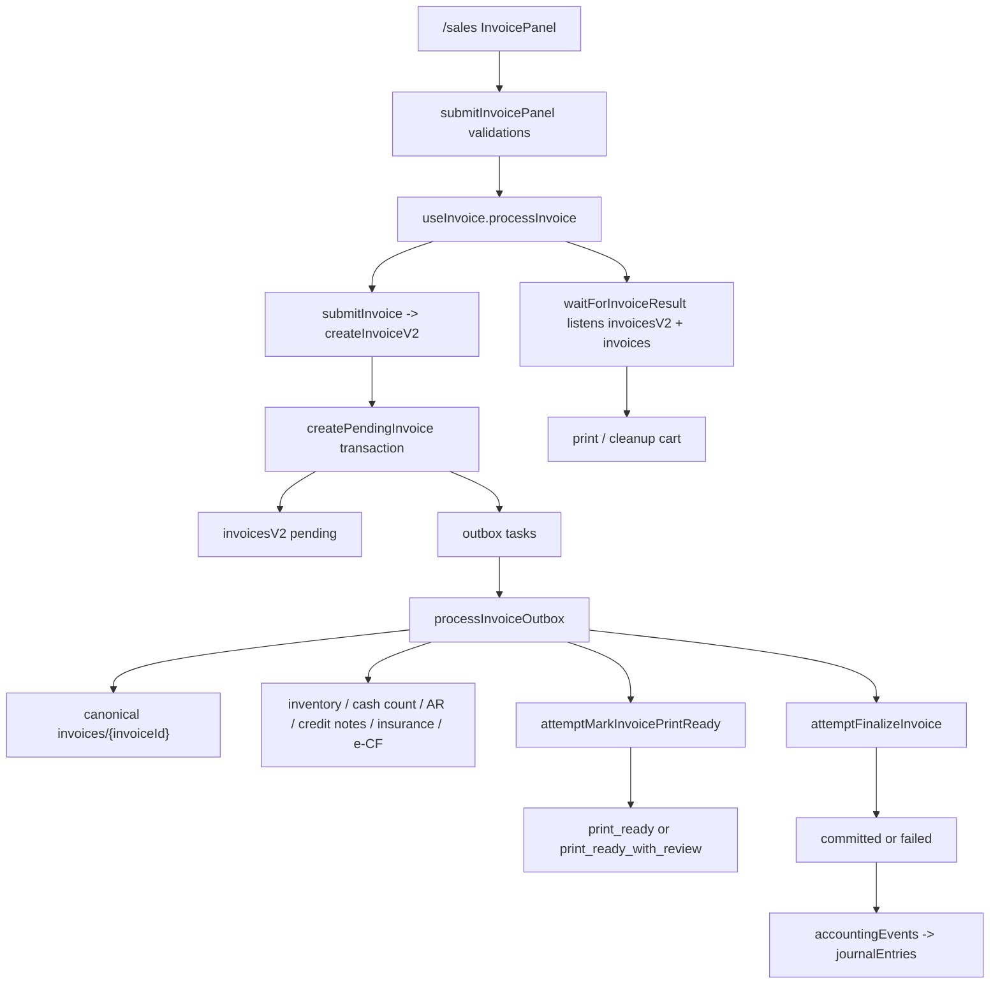

# Auditoria fresca del sistema de facturacion de VentaMas

Fecha de corte: 2026-06-22  
Repositorio: `C:\Dev\VentaMas`  
Alcance: facturacion operativa de ventas/POS, facturas canonicas, CxC, caja, NCF/e-CF, notas de credito/debito y efectos contables conectados.

## 1. Como se hizo esta exploracion

Este archivo se preparo desde cero leyendo el codigo actual del repositorio. No usa auditorias ni documentos previos como fuente. Se revisaron rutas, componentes React, servicios cliente, Cloud Functions, reglas de Firestore, tests y superficies de recuperacion. La intencion es que un evaluador senior o ChatGPT pueda revisar arquitectura, patrones, riesgos y oportunidades sin tener que redescubrir el flujo completo.

Se usaron exploradores en paralelo para separar perspectivas: frontend/UX operativo, backend/orquestacion de facturas, y reglas/datos/pruebas. Luego se consolidaron hallazgos aqui, manteniendo solo evidencia del codigo actual.

Importante: en el repo hay una segunda familia llamada `billing`, pero esa corresponde principalmente a suscripciones/planes del negocio. Este documento se enfoca en facturacion de ventas. Se menciona `billing` solo cuando afecta limites de uso o acceso a crear facturas.

## 2. Lectura ejecutiva

El sistema de facturacion actual esta construido como un flujo backend-authoritative con idempotencia, outbox, estados intermedios, factura canonica para UI/reportes y reglas de Firestore que bloquean escrituras directas en documentos financieros ya emitidos.

El patron principal es una variante de:

- Application service en frontend: `submitInvoicePanel` + `useInvoice`.
- Backend command/callable: `createInvoiceV2`.
- Transactional outbox: tareas bajo `businesses/{businessId}/invoicesV2/{invoiceId}/outbox`.
- Read model/canonical document: `businesses/{businessId}/invoices/{invoiceId}`.
- Event/audit timeline: `invoicesV2`, `timeline`, `audit`, `accountingEvents`.
- Recovery/manual retry: `repairInvoiceV2Http`, `autoRepairInvoiceV2Http`, DevTools `InvoiceV2Recovery`.

Esto es mas robusto que escribir la factura completa desde el cliente, especialmente por la cantidad de efectos laterales: NCF/e-CF, inventario, caja, CxC, notas de credito, seguro, comisiones, uso del plan, contabilidad y DGII.

Las principales areas a revisar no parecen ser "falta de patron", sino consistencia eventual, duplicacion de validaciones frontend/backend, convivencia de `invoicesV2` y `invoices`, deuda de imports directos a `httpsCallable`, y la concentracion de mucha decision de negocio en `InvoicePanel`/`submitInvoicePanel` y `outbox.worker.js`.

## 3. Tecnologias relevantes

- Frontend: React 19, TypeScript, Vite, Redux Toolkit, Ant Design, styled-components.
- Backend: Firebase Cloud Functions v2, Node 24, JavaScript/TypeScript mixto en `functions/src`.
- Persistencia: Cloud Firestore.
- Tipo de producto: SaaS/POS para comercios, con ventas, preventas, inventario, caja, facturacion fiscal, CxC, notas, reportes DGII y configuraciones por negocio.
- Fiscal/e-CF: NCF legacy, e-CF, GISYS FACT, DGII 606/607/608.
- Reporteria/contabilidad: `accountingEvents`, `journalEntries`, compliance DGII.
- PDF/impresion: plantillas en `src/modules/invoice/components/Invoice`, `src/pdf/invoicesAndQuotation`, y cambios actuales en Vivliostyle dentro del arbol sucio.

## 4. Rutas y pantallas principales

Definicion de rutas:

- `src/router/routes/routesName.ts`
- `src/router/routes/paths/Sales.tsx`
- `src/router/routes/paths/CreditNote.tsx`
- `src/router/routes/paths/DebitNote.tsx`
- `src/modules/sales/public.ts`
- `src/modules/invoice/public.ts`

Rutas de negocio conectadas a facturacion:

- `/sales`: POS y creacion de venta/factura. Carga `src/modules/sales/pages/Sale/Sale.tsx`.
- `/bills`: historial/listado de facturas. Carga `src/modules/invoice/pages/InvoicesPage/InvoicesPage.tsx`.
- `/bills/analytics`: analitica de ventas.
- `/bills/service-commissions`: reporte de comisiones de servicios generadas por facturacion.
- `/preorders`: preventas que pueden convertirse a factura.
- `/credit-note`: listado/flujo de notas de credito.
- `/debit-note`: listado/flujo de notas de debito.
- `/account-receivable/list`: CxC y cobros posteriores.
- `/cash-reconciliation`, `/cash-register-opening`, `/cash-register-closure/:id`: caja/cuadre.
- `/accounting/fiscal-compliance`: reportes DGII y cumplimiento.
- `/dev/tools/invoice-v2-recovery`: diagnostico y reparacion de facturas V2.
- `/dev/tools/electronic-tax-receipt-provider`: configuracion/validacion proveedor e-CF.
- `/settings/tax-receipt`: configuracion de comprobantes fiscales.
- `/settings/billing`: configuracion de facturacion visual/operativa del POS, no confundir con suscripcion SaaS.

## 5. Flujo principal de frontend

### 5.1 Entrada desde POS

Archivos principales:

- `src/modules/sales/pages/Sale/Sale.tsx`
- `src/modules/sales/pages/Sale/components/Cart/components/InvoicePanel/hooks/useInvoicePanelController.ts`
- `src/modules/sales/pages/Sale/components/Cart/components/InvoicePanel/utils/submitInvoicePanel.ts`
- `src/modules/sales/pages/Sale/components/Cart/components/InvoicePanel/utils/validateInvoiceSubmissionGuards.ts`
- `src/modules/sales/pages/Sale/components/Cart/components/InvoicePanel/utils/invoiceSubmissionIdempotency.ts`
- `src/services/invoice/useInvoice.ts`
- `src/services/invoice/invoice.service.ts`
- `src/services/invoice/types.ts`

Resumen del flujo:

1. El usuario arma el carrito en `/sales`.
2. `InvoicePanel` toma datos de Redux: carrito, cliente, usuario, negocio, NCF, CxC, seguro, modo test, settings de billing y metodos de pago.
3. `useInvoicePanelController` calcula contexto operativo, crea una semilla de idempotencia y llama `submitInvoicePanel`.
4. `submitInvoicePanel` valida precondiciones antes de llamar backend.
5. `useInvoice.processInvoice` llama `submitInvoice`, luego espera `waitForInvoiceResult`.
6. `submitInvoice` ejecuta callable `createInvoiceV2`.
7. `waitForInvoiceResult` escucha dos documentos:
   - meta/orquestacion: `businesses/{businessId}/invoicesV2/{invoiceId}`
   - factura canonica: `businesses/{businessId}/invoices/{invoiceId}`
8. Cuando `invoicesV2.status` entra en un estado imprimible y la canonica esta lista, el frontend imprime o finaliza limpieza del carrito.

Estados imprimibles reconocidos en frontend:

- `committed`
- `frontend_ready`
- `print_ready`
- `print_ready_with_review`

El servicio cliente intenta usar listeners `onSnapshot`; si falla abrir el listener temporal, cae a polling.

### 5.2 Validaciones previas en UI

`submitInvoicePanel.ts` cubre estas reglas antes de llamar backend:

- El carrito debe tener productos.
- Si comprobantes fiscales estan activos, debe existir tipo de comprobante.
- Facturas fiscales que requieren identificacion deben tener cliente con RNC/cedula.
- Consumidor final por debajo de RD$250,000 puede no requerir identificacion.
- Si el modelo fiscal electronico no esta activo, valida disponibilidad local del NCF.
- Bloquea si la moneda/document currency tiene `blockedReason`.
- Ejecuta `validateInvoiceSubmissionGuards`.
- Si la venta va a CxC, valida campos del formulario.

`validateInvoiceSubmissionGuards.ts` agrega:

- Debe existir un cuadre de caja abierto para el usuario.
- Productos con `restrictSaleWithoutStock` requieren `productStockId` y `batchId`.
- Servicios con comisiones pueden requerir colaborador.
- Colaborador de servicio debe ser elegible para comision si la configuracion esta activa.

Observacion de diseno: muchas reglas de negocio viven tanto en frontend como backend. Esto mejora UX, pero exige mantener paridad. La regla de cliente fiscal, por ejemplo, aparece en `submitInvoicePanel.ts` y se repite en `orchestrator.service.js`.

### 5.3 Payload e idempotencia en cliente

`buildInvoiceRequestPayload` en `src/services/invoice/invoice.service.ts` normaliza:

- `businessId` y `userId`.
- `cart`, incluyendo `productStockId` y `batchId` nulos si faltan.
- `client`.
- `accountsReceivable` con fechas normalizadas.
- `insuranceAR` e `insuranceAuth`.
- `taxReceiptEnabled`, `ncfType`, `ncf`.
- `dueDate`, `invoiceComment`.
- `preorder`.
- `isTestMode`.
- `monetary` usando `resolveMonetarySnapshotForBusiness`.
- metodos de pago bancarios usando politica contable/bancaria.

La llave de idempotencia viene de `buildInvoiceSubmissionIdempotencyKey`, que hashea una version estable del carrito, cliente, CxC, seguro, NCF, moneda, comisiones y usuario, mas una semilla local. Si backend responde `already-exists` por conflicto, el panel puede resetear la semilla.

Riesgo a revisar: la idempotencia depende de que la normalizacion frontend y backend no diverjan. El backend tambien puede derivar fallback con `cart.id` o hash estable del carrito si no llega llave.

## 6. Flujo principal de backend

### 6.1 Entry points exportados

Archivo raiz:

- `functions/src/index.js`

Funciones principales de facturacion:

- `createInvoiceV2`: callable principal desde frontend.
- `createInvoiceV2Http`: variante HTTP.
- `getInvoiceV2Http`: resumen/diagnostico.
- `repairInvoiceV2Http`: reprograma tareas de outbox.
- `autoRepairInvoiceV2Http`: reparacion masiva/asistida.
- `processInvoiceOutbox`: trigger de outbox.
- `processInvoiceCompensation`: trigger de compensaciones.
- `updateInvoiceFinancialDocument`: edita solo facturas draft sin huella.
- `deleteDraftInvoice`: borra solo facturas draft sin huella.
- `voidInvoiceFinancialDocument`: anulacion formal de facturas emitidas.
- `createCustomerCreditNote`, `updateCustomerCreditNote`, `applyCustomerCreditNotes`.
- `processCustomerCreditNoteOutbox`.
- `createCustomerDebitNote`, `updateCustomerDebitNote`.
- `processCustomerDebitNoteOutbox`.
- `processAccountsReceivablePayment`.
- `runMonthlyComplianceReport`, `exportDgiiTxtReport`.
- `projectAccountingEventToJournalEntry`.

### 6.2 `createInvoiceV2`

Archivo:

- `functions/src/app/versions/v2/invoice/controllers/createInvoice.controller.js`

Responsabilidades:

- Resolver `traceId`.
- Resolver idempotencia desde header/body o derivar fallback.
- Autenticar con `resolveRequiredCallableActorUid`.
- Resolver `businessId` y forzar `userId = authUid`.
- Validar membresia/rol con `assertUserAccess` y `MEMBERSHIP_ROLE_GROUPS.INVOICE_OPERATOR`.
- Validar acceso por suscripcion/plan con `assertBusinessSubscriptionAccess` y `LIMIT_OPERATION_KEYS.INVOICE_CREATE`.
- Validar NCF requerido si `ncf.enabled`.
- Validar carrito con `validateInvoiceCart`.
- Si la venta es CxC, exigir `accountsReceivable.totalInstallments`.
- Validar cuadre de caja abierto.
- Llamar `createPendingInvoice`.
- Responder `{ status: 'pending', invoiceId, reused }`.

Patron: el callable no intenta hacer todo. Solo crea un documento `invoicesV2` y tareas outbox en una transaccion, y el frontend espera hasta que el read model este disponible.

### 6.3 `createPendingInvoice`

Archivo:

- `functions/src/app/versions/v2/invoice/services/orchestrator.service.js`

Transaccion principal. Lee/escribe:

- `businesses/{businessId}`
- `businesses/{businessId}/settings/accounting`
- `businesses/{businessId}/settings/taxReceipt`
- `platformConfig/gisysFact`
- `businesses/{businessId}/usage/current`
- `businesses/{businessId}/usage/monthly/entries/{monthKey}`
- `businesses/{businessId}/idempotency/{idempotencyKey}`
- `businesses/{businessId}/invoicesV2/{invoiceId}`
- `businesses/{businessId}/invoicesV2/{invoiceId}/timeline/{eventId}`
- `businesses/{businessId}/invoicesV2/{invoiceId}/audit/{auditId}`
- `businesses/{businessId}/invoicesV2/{invoiceId}/outbox/{taskId}`
- `businesses/{businessId}/ncfUsage/{usageId}` si NCF legacy.
- `businesses/{businessId}/taxReceipts/{taxReceiptId}` via `reserveNcf`.

Reglas importantes:

- Idempotencia: si la llave existe y el hash del payload coincide, reutiliza la factura; si no coincide, lanza `already-exists`.
- Limites de plan: para planes `demo` y `plus`, valida `monthlyInvoices`.
- Periodo contable: si contabilidad esta activa, valida que el periodo este abierto.
- NCF: si el negocio exige comprobante fiscal, bloquea ventas sin comprobante.
- Cliente fiscal: vuelve a validar identidad fiscal cuando el documento lo requiere.
- e-CF: si el rollout electronico esta activo, no reserva NCF legacy; prepara snapshot `electronicTaxReceipt` y tarea `issueElectronicTaxReceipt`.
- Legacy NCF: si no esta en modelo electronico, reserva NCF transaccionalmente con `reserveNcf`.

Tareas outbox creadas:

- `updateInventory`: descuenta inventario/stock si aplica.
- `createCanonicalInvoice`: crea/actualiza `businesses/{businessId}/invoices/{invoiceId}`.
- `issueElectronicTaxReceipt`: emite o prepara e-CF via GISYS si aplica.
- `attachToCashCount`: vincula factura al cuadre de caja.
- `closePreorder`: cierra preventa si la factura viene de preventa.
- `setupAR`: crea CxC y cuotas.
- `consumeCreditNotes`: consume notas de credito aplicadas al pago.
- `setupInsuranceAR`: crea CxC de seguro si aplica.

### 6.4 `processInvoiceOutbox`

Archivo:

- `functions/src/app/versions/v2/invoice/triggers/outbox.worker.js`

Trigger:

- `businesses/{businessId}/invoicesV2/{invoiceId}/outbox/{taskId}`

Comportamiento general:

- Solo procesa tareas `status: 'pending'`.
- Abre transaccion, re-lee tarea e invoice.
- Deriva actor desde la factura para evitar confiar en payload alterado.
- Si la factura esta `pending`, la mueve a `committing`.
- Procesa cada tipo de tarea.
- Marca tarea `done` o `failed`.
- Siempre intenta `attemptMarkInvoicePrintReady` y `attemptFinalizeInvoice` despues de cada tarea.

Efectos por tarea:

- `updateInventory`: llama `adjustProductInventory`; puede generar COGS via contabilidad/inventario.
- `createCanonicalInvoice`: escribe `businesses/{businessId}/invoices/{invoiceId}` con `data`, asigna `numberID`, cliente, NCF, fecha, pago, moneda, `cashCountId`, e-CF y comisiones.
- `issueElectronicTaxReceipt`: delega a `processElectronicTaxReceiptOutboxTask`.
- `attachToCashCount`: vincula en `cashCounts/{cashCountId}/sales/{invoiceId}`, read model `cashCountSales/{cashCountId}__{invoiceId}`, legacy array `cashCount.sales`, y opcionalmente `cashMovements`.
- `setupAR`: crea `accountsReceivable` y `accountsReceivableInstallments`; evita duplicar si ya existe CxC para la factura.
- `consumeCreditNotes`: valida y consume notas en transaccion, crea `creditNoteApplications`.
- `setupInsuranceAR`: crea autorizacion de seguro y CxC de seguro.
- `closePreorder`: actualiza historial/estado canonico.

Riesgo a revisar: `outbox.worker.js` concentra mucha logica de dominios distintos. La separacion existe por imports dinamicos, pero el archivo sigue siendo un coordinador grande con ramas de negocio extensas.

### 6.5 `attemptMarkInvoicePrintReady`

Archivo:

- `functions/src/app/versions/v2/invoice/services/printReady.service.js`

Decide si una factura puede estar lista para imprimir antes de estar totalmente `committed`.

Reglas:

- Requiere factura canonica o estado compatible.
- Bloquea si inventario con trabajo real no termino.
- Bloquea si e-CF esperado sigue pendiente o fallo en modo requerido.
- Requiere CxC, notas de credito y seguro terminados si existen.
- Caja fallida se considera revision operativa, no necesariamente bloqueo absoluto.
- Puede escribir `print_ready` o `print_ready_with_review`.

Esto explica por que el frontend acepta `print_ready` y `print_ready_with_review` como imprimibles.

### 6.6 `attemptFinalizeInvoice`

Archivo:

- `functions/src/app/versions/v2/invoice/services/finalize.service.js`

Finaliza cuando no quedan tareas pendientes:

- Si hay fallos bloqueantes, marca `invoicesV2.status = failed`, agenda compensaciones y marca idempotencia `failed`.
- Si solo hay fallos no bloqueantes, actualmente `attachToCashCount`, permite commit con revision.
- Consume NCF reservado (`ncfUsage.status = used`).
- Si contabilidad esta activa, crea `accountingEvents/invoice.committed__{invoiceId}`.
- Actualiza status final (`committed`) y timeline.

Politica de fallo no bloqueante:

- `functions/src/app/versions/v2/invoice/services/failurePolicy.service.js`
- `NON_BLOCKING_FAILED_TASK_TYPES = new Set(['attachToCashCount'])`

Esta es una decision de negocio importante: caja puede requerir revision, pero no necesariamente tumbar la factura completa.

### 6.7 Compensaciones

Archivos:

- `functions/src/app/versions/v2/invoice/triggers/compensation.worker.js`
- `functions/src/app/versions/v2/invoice/services/compensation.service.js`

Si una factura falla con tareas ya completadas, `scheduleCompensationsInTx` agenda compensaciones bajo:

- `businesses/{businessId}/invoicesV2/{invoiceId}/compensations/{compId}`

Compensaciones implementadas:

- `setupAR`: marca CxC y cuotas como `voided`.
- `consumeCreditNotes`: restaura saldos y elimina aplicaciones.
- `createCanonicalInvoice`: borra factura canonica, salvo si solo hubo fallos no bloqueantes.
- `attachToCashCount`: desvincula venta de caja.
- `closePreorder`: agrega historia revertida.
- NCF pending puede marcarse `voided`.

Limitacion explicita: compensacion de inventario aparece marcada para manejo manual en el worker.

## 7. Factura canonica vs factura V2

Hay dos documentos principales:

- `businesses/{businessId}/invoicesV2/{invoiceId}`: meta-orquestador, estado del pipeline, snapshot inicial, timeline, outbox, audit, compensaciones.
- `businesses/{businessId}/invoices/{invoiceId}`: read model canonico consumido por UI, reportes, CxC, compliance y plantillas. El payload principal vive en el campo `data`.

La pantalla `/bills` no lee `invoicesV2`; lee `businesses/{businessId}/invoices` con `useFbGetInvoicesWithFilters`.

Archivo:

- `src/firebase/invoices/useFbGetInvoicesWithFilters.ts`

El listener:

- Filtra por `data.date`.
- Filtra por `data.client.id` si aplica.
- Despues de 2024-01-21 restringe por `data.userID` si el rol no tiene manage-all.
- Excluye `data.status === 'cancelled'`.
- Aplica filtros cliente-side de CxC, metodo de pago, monto y estado de pago.

Riesgo a revisar: la UI depende de que `createCanonicalInvoice` termine y mantenga el contrato historico de `invoices.data`. Cualquier cambio en `invoicesV2` que no se proyecte a `invoices` puede no verse en historial/reportes.

## 8. Seguridad y reglas Firestore

Archivo:

- `firestore.rules`

Reglas relevantes:

- `businesses/{businessId}/invoices`: lectura con acceso al negocio. Creacion directa desde cliente solo para borradores seguros (`isSafeInvoiceDraftCreate`). Update/delete solo si es draft y sin huella fiscal/contable.
- `businesses/{businessId}/invoicesV2`: read permitido, create/update/delete bloqueados desde cliente.
- `creditNotes`, `creditNoteApplications`, `accountsReceivable`, `accountsReceivablePayments`, `accountsReceivableInstallments`, `accountsReceivableInstallmentPayments`, `payments`, `serviceCommissions`, `hrCommissionEntries`, `cashMovements`, `cashCountSales`, `ncfUsage`, `ncfLedger`, `taxReportRuns`, `dgiiReports`: escrituras bloqueadas desde cliente.
- `journalEntries` y `accountingEvents`: escrituras bloqueadas desde cliente.
- `taxReceipts`: create/update permitido a usuarios con acceso de configuracion financiera.

Este diseno indica una migracion clara: las superficies financieras sensibles se estan cerrando para obligar mutaciones via backend/callables.

Prueba relacionada:

- `src/firebase/firestoreRulesHardening.test.ts`

## 9. NCF, e-CF y GISYS FACT

Archivos clave:

- `functions/src/app/versions/v2/invoice/services/ncf.service.js`
- `functions/src/app/modules/electronicTaxReceipts/services/electronicTaxReceiptOutbox.service.js`
- `functions/src/app/modules/electronicTaxReceipts/services/gisysFactClient.service.js`
- `functions/src/app/modules/electronicTaxReceipts/mappers/gisysIssuePayload.mapper.js`
- `src/modules/invoice/pages/InvoicesPage/hooks/usePendingElectronicTaxReceiptAutoRefresh.ts`
- `src/firebase/electronicTaxReceipts/fbRefreshElectronicTaxReceiptStatus.ts`

NCF legacy:

- `reserveNcf` lee la configuracion de comprobante.
- Calcula secuencia con longitud legacy B o longitud electronica/default.
- Evita duplicados buscando en `businesses/{businessId}/invoices` por `data.NCF`.
- Actualiza `taxReceipt`.
- Crea `ncfUsage` con `status: pending`.
- Al finalizar la factura, `finalize.service` marca `ncfUsage` como `used`.

e-CF/GISYS:

- `orchestrator.service` decide si el rollout electronico esta activo.
- Si esta activo, prepara snapshot `electronicTaxReceipt` y tarea `issueElectronicTaxReceipt`.
- `processElectronicTaxReceiptOutboxTask` construye payload GISYS y usa idempotency key `ventamas:{businessId}:{invoiceId}:ecf:{documentType}:v1`.
- En modo `shadow`, marca `shadow_ready` sin transporte real.
- En modo con transporte, llama GISYS con `issueGisysFactDocument`.
- Si falla y el modo es `required`, la tarea falla y puede bloquear.
- Si falla en modo no requerido, se guarda como `local_failed` pero puede permitir impresion con revision.
- La canonica se actualiza con `electronicTaxReceipt`, `fiscal.electronic`, `fiscalMode`, `documentFormat`, `NCF/eNcf` si existe.

Auto-refresh:

- `/bills` ejecuta `usePendingElectronicTaxReceiptAutoRefresh`.
- Refresca hasta 5 facturas por pasada si el e-CF tiene `submissionId`, no esta terminal y paso el intervalo minimo.

Riesgo a revisar: hay multiples estados fiscales (`issued`, `submitted`, `accepted`, `accepted_conditional`, `rejected`, `local_failed`, `shadow_ready`) y multiples fuentes (`invoice.snapshot`, canonica, `fiscal.electronic`). La normalizacion esta cubierta por helpers/tests, pero es un punto sensible.

## 10. Notas de credito y debito

Frontend:

- `src/firebase/creditNotes/fbAddCreditNote.ts`
- `src/firebase/creditNotes/fbUpdateCreditNote.ts`
- `src/firebase/creditNotes/fbConsumeCreditNotes.ts`
- `src/modules/invoice/firebase/debitNotes/fbAddDebitNote.ts`
- `src/modules/invoice/pages/CreditNote/components/CreditNoteModal/CreditNoteModal.tsx`
- `src/modules/invoice/pages/CreditNote/CreditNoteList/CreditNoteList.tsx`
- `src/modules/invoice/pages/DebitNote/DebitNoteList/DebitNoteList.tsx`

Backend:

- `functions/src/app/modules/accountReceivable/functions/customerCreditNotes.js`
- `functions/src/app/modules/accountReceivable/functions/customerDebitNotes.js`
- `functions/src/app/modules/accountReceivable/functions/customerCreditNoteOutbox.worker.js`
- `functions/src/app/modules/accountReceivable/functions/customerDebitNoteOutbox.worker.js`
- `functions/src/app/modules/accountReceivable/functions/syncCustomerCreditNoteAccountingEvents.js`
- `functions/src/app/modules/accountReceivable/functions/syncCustomerDebitNoteAccountingEvents.js`
- `functions/src/app/modules/accountReceivable/functions/repairCustomerAdjustmentNoteFinancialEffects.js`

Patron:

- El cliente ya no escribe notas emitidas directamente.
- Crear nota pasa por callable.
- Backend valida cliente, factura afectada, montos/codigos DGII, estado fiscal y disponibilidad NCF/e-CF.
- Se reservan NCF o se prepara e-CF E33/E34.
- Se crean outbox tasks para estado electronico.
- Se sincronizan eventos contables.
- `applyCustomerCreditNotes` consume saldos transaccionalmente y crea aplicaciones.

Reglas importantes:

- Nota de credito con codigo DGII 2 no puede tener importe positivo.
- Nota debe pertenecer al mismo cliente/factura.
- Nota electronica no aceptada puede bloquear efectos financieros segun estado.
- Una nota aplicada/cancelada/emitida es inmutable desde cliente.

## 11. CxC y pagos

Archivos:

- `functions/src/app/modules/accountReceivable/functions/processAccountsReceivablePayment.js`
- `src/firebase/processAccountsReceivablePayments/fbProcessClientPaymentAR.ts`
- `src/features/accountsReceivable/accountPayment/...`

La factura puede crear CxC desde `setupAR`. Los pagos posteriores se procesan por `processAccountsReceivablePayment`, que:

- Usa callable desde frontend.
- Recibe `idempotencyKey`.
- Normaliza snapshot monetario.
- Actualiza cuentas, cuotas e invoice aggregates.
- Crea `accountsReceivablePayments`.
- Crea `cashMovements` para tesoreria.
- Puede crear `accountingEvents`.
- Actualiza `businesses/{businessId}/invoices/{invoiceId}` con pago/balance.

Riesgo detectado en frontend: `fbProcessClientPaymentAR.ts` todavia consume notas de credito despues del pago con `fbConsumeCreditNotes` en un segundo paso y atrapa errores con `console.error`. Si la nota de credito forma parte de un pago de CxC, conviene revisar si esa aplicacion debe ser atomica en el backend del pago para evitar cobro exitoso + aplicacion de nota fallida.

## 12. Caja y movimientos

Archivos:

- `functions/src/app/modules/cashCount/services/cashCountSales.service.js`
- `functions/src/app/modules/cashCount/functions/openCashCount.js`
- `functions/src/app/modules/cashCount/functions/closeCashCount.js`
- `functions/src/app/versions/v2/accounting/utils/cashMovement.util.js`

El flujo exige caja abierta antes de crear factura:

- Frontend: `validateInvoiceSubmissionGuards` llama `checkOpenCashReconciliation`.
- Backend: `createInvoiceV2` revalida con `getOpenCashCountDoc` y `checkOpenCashCount`.

La tarea `attachToCashCount`:

- Usa el `cashCountId` preferido capturado al inicio.
- Si ya existe vinculo, no duplica.
- Si no encuentra, busca por read model y legacy array.
- Puede caer a caja abierta actual como fallback.
- Escribe:
  - subcoleccion `cashCounts/{cashCountId}/sales/{invoiceId}`
  - read model `cashCountSales/{cashCountId}__{invoiceId}`
  - legacy `cashCount.sales` array
  - `cashMovements` si contabilidad/tesoreria aplica.

Decision sensible: si `attachToCashCount` falla, puede quedar como revision no bloqueante. Esto evita perder venta, pero requiere buenos reportes operativos para que caja no quede descuadrada sin seguimiento.

## 13. Contabilidad, cumplimiento y reportes DGII

Archivos:

- `functions/src/app/versions/v2/invoice/services/finalize.service.js`
- `functions/src/app/versions/v2/accounting/projectAccountingEventToJournalEntry.js`
- `functions/src/app/versions/v2/accounting/utils/accountingEvent.util.js`
- `functions/src/app/versions/v2/accounting/utils/cashMovement.util.js`
- `functions/src/app/modules/compliance/services/dgii607MonthlyReport.service.js`
- `functions/src/app/modules/compliance/services/dgii608MonthlyReport.service.js`
- `functions/src/app/modules/compliance/services/dgii606MonthlyReport.service.js`
- `functions/src/app/modules/compliance/functions/runMonthlyComplianceReport.js`
- `functions/src/app/modules/compliance/functions/exportDgiiTxtReport.js`

Cuando la factura finaliza:

- Puede crear `accountingEvents/invoice.committed__{invoiceId}`.
- La proyeccion contable crea `journalEntries`.
- Inventario puede crear eventos COGS.
- Anulacion formal crea reversos contables.
- DGII 607 lee `businesses/{businessId}/invoices`, `creditNotes`, `debitNotes` y retenciones.
- DGII 608 depende de facturas/notas anuladas.

La facturacion no es un modulo aislado: es el centro de varios read models contables/fiscales.

## 14. Ciclo de vida: editar, borrar y anular

Archivos:

- `src/firebase/invoices/fbUpdateInvoice.ts`
- `src/firebase/invoices/fbDeleteMultipleInvoices.tsx`
- `src/firebase/invoices/fbCancelInvoice.ts`
- `functions/src/app/modules/invoice/functions/invoiceLifecycle.js`

Reglas:

- `updateInvoiceFinancialDocument` solo permite editar facturas `draft` sin NCF, numero, caja, CxC, pagos o huella contable.
- `deleteDraftInvoice` solo permite borrar drafts sin huella.
- `voidInvoiceFinancialDocument` exige motivo DGII.
- No permite anular si hay pagos aplicados o movimientos de caja/banco asociados.
- Si hay CxC con pagos, exige anular cobros primero.
- Si hay eventos contables sin asiento proyectado, bloquea hasta resolver la proyeccion.
- Al anular:
  - marca `invoices.data.status = cancelled`
  - marca `invoicesV2.status = voided` si existe
  - restaura stock simple
  - restaura stock detallado si hay COGS lines
  - marca CxC como voided
  - marca `ncfUsage` como voided
  - anula comisiones de servicios
  - crea reversos contables para `invoice.committed` y COGS si aplica.

Esto es una buena senal: la mutacion post-emision se maneja por documentos correctivos/reversos, no por edicion directa.

## 15. Modelos de datos principales

Colecciones relevantes bajo `businesses/{businessId}`:

- `invoicesV2/{invoiceId}`: estado de pipeline, snapshot, status timeline, timing, idempotency.
- `invoicesV2/{invoiceId}/outbox/{taskId}`: tareas pendientes/done/failed.
- `invoicesV2/{invoiceId}/timeline/{eventId}`: timeline granular.
- `invoicesV2/{invoiceId}/audit/{auditId}`: auditoria de acciones.
- `invoicesV2/{invoiceId}/compensations/{compId}`: compensaciones.
- `idempotency/{idempotencyKey}`: relacion llave/payload/invoiceId.
- `invoices/{invoiceId}`: factura canonica en campo `data`.
- `ncfUsage/{usageId}`: NCF pending/used/voided.
- `ncfLedger/{ledgerId}`: ledger fiscal.
- `taxReceipts/{taxReceiptId}`: configuracion/secuencias de comprobantes.
- `creditNotes/{creditNoteId}` y `debitNotes/{debitNoteId}`.
- `creditNoteApplications/{applicationId}`.
- `accountsReceivable/{arId}`.
- `accountsReceivableInstallments/{installmentId}`.
- `accountsReceivablePayments/{paymentId}`.
- `cashCounts/{cashCountId}` y `cashCounts/{cashCountId}/sales/{invoiceId}`.
- `cashCountSales/{cashCountId}__{invoiceId}`.
- `cashMovements/{movementId}`.
- `serviceCommissions/{commissionId}`.
- `hrCommissionEntries/{entryId}`.
- `accountingEvents/{eventId}`.
- `journalEntries/{entryId}`.
- `taxReportRuns/{runId}` y `dgiiReports/{reportId}`.
- `usage/current` y `usage/monthly/entries/{monthKey}`.

Indices relevantes:

- `firestore.indexes.json` contiene collection groups para `invoices`, `creditNotes`, `debitNotes`, `accountsReceivable`, `accountsReceivableInstallments`, `accountsReceivablePayments`, `cashCounts`, `cashCountSales` indirectamente por read model/reglas, `outbox`, `productsStock`, entre otros.

## 16. Patrones de arquitectura observados

### Patrones positivos

- Backend como autoridad para documentos financieros.
- Transactional outbox para separar creacion inicial de efectos laterales.
- Idempotencia por llave + hash de payload.
- Read model canonico para compatibilidad con UI/reportes.
- Timeline/audit para diagnostico.
- Reglas Firestore cierran escrituras financieras directas.
- Funciones de reparacion para reprogramar tareas sin editar Firestore a mano.
- Validaciones duplicadas frontend/backend para UX y seguridad.
- Estados imprimibles separados de estados finales (`print_ready` vs `committed`).
- Politica explicita para fallos no bloqueantes.
- Tests amplios en servicios criticos.

### Complejidad esencial

- Legislacion fiscal dominicana y DGII.
- NCF legacy + e-CF + GISYS.
- Facturas de contado y credito.
- Caja/cuadre por usuario.
- Inventario por producto/lote/existencia fisica.
- Notas de credito/debito con reglas fiscales.
- Contabilidad, COGS y reversos.
- Seguro y CxC de seguro.
- Comisiones de servicios y RRHH.
- Suscripcion/plan limitando operaciones.

### Complejidad accidental o deuda

- `outbox.worker.js` contiene demasiadas ramas de negocio y podria beneficiarse de handlers por task type.
- `submitInvoicePanel.ts` combina validacion fiscal, caja, stock, comisiones, tracing, UI notifications, impresion y cleanup.
- `src/services/invoice/invoice.service.ts` importa `httpsCallable` directo; hay un wrapper nuevo `createFirebaseCallable`, pero la prueba `callableImportGuard` mantiene este archivo como deuda permitida.
- Varias validaciones fiscales estan duplicadas en frontend y backend.
- Convivencia de `invoicesV2` y `invoices` exige proyeccion canonica perfecta.
- Recuperacion de outbox fallido depende de herramientas de reparacion; conviene revisar si ciertos fallos deberian tener retry automatico controlado.
- Algunas compensaciones son parciales; inventario se marca para manejo manual en compensacion.
- El pago de CxC con notas de credito parece no ser atomico de punta a punta desde el frontend.
- Existen archivos de invoice/plantillas actualmente modificados en el working tree; cualquier auditoria visual de impresion debe considerar esos cambios no commiteados.

## 17. Hallazgos puntuales confirmados

Estos puntos no son conclusiones de documentacion previa; salieron de la lectura directa del codigo actual y de exploradores en paralelo. Estan separados del mapa arquitectonico porque merecen revision prioritaria.

### 17.1 Alto: compensaciones V2 pueden fallar por import faltante

Archivo:

- `functions/src/app/versions/v2/invoice/services/compensation.service.js`

El archivo importa solo `db`:

- `import { db } from '../../../../core/config/firebase.js';`

Pero usa `FieldValue.serverTimestamp()` en `scheduleCompensationsInTx`, `compensateAR`, `compensateCreditNotes`, `compensateInsuranceAR` y `compensateCanonicalInvoice`.

Ruta de impacto:

- `functions/src/app/versions/v2/invoice/services/finalize.service.js` llama `scheduleCompensationsInTx` cuando hay tareas fallidas bloqueantes.
- Si esa rama se ejecuta en runtime, `FieldValue` no esta definido y la factura puede no quedar compensada correctamente.
- Los tests de `finalize.service` mockean `compensation.service.js`, y `compensation.worker.test.js` tambien mockea helpers; por eso este problema puede pasar aunque pruebas focalizadas de finalizacion/worker esten verdes.

Recomendacion directa:

- Importar `FieldValue` desde `core/config/firebase.js`.
- Agregar test unitario real de `scheduleCompensationsInTx` sin mockear el servicio.

### 17.2 Alto: pagos CxC y consumo de notas de credito no son atomicos

Archivo:

- `src/firebase/processAccountsReceivablePayments/fbProcessClientPaymentAR.ts`

El callable `processAccountsReceivablePayment` procesa el pago y retorna recibo. Despues, si hay `creditNotePayment`, el frontend llama `fbConsumeCreditNotes`. Si esa segunda operacion falla, el error se atrapa con `console.error` y no revierte el pago ni falla la operacion principal.

Riesgo:

- Pago/recibo aplicado correctamente.
- Nota de credito no rebajada o no aplicada.
- Posible reutilizacion de saldo de nota o descuadre entre CxC, recibo y aplicaciones.

Recomendacion directa:

- Mover la aplicacion de notas de credito dentro del backend de `processAccountsReceivablePayment`, en la misma transaccion o en una unidad backend idempotente.
- Si por diseno debe seguir separado, crear estado visible de `credit_note_application_failed` y herramienta de reparacion.

### 17.3 Alto: preventas legacy escriben directo en `invoices` con `status: pending`

Archivos:

- `src/firebase/invoices/fbAddPreorder.ts`
- `src/firebase/invoices/fbUpdatePreorder.ts`
- `src/firebase/invoices/fbCancelPreorder.ts`
- `firestore.rules`

Las reglas actuales de `businesses/{businessId}/invoices/{invoiceId}` permiten crear/actualizar desde cliente solo documentos `draft` y sin huella fiscal/contable. Sin embargo, las preventas legacy escriben directo en `invoices` con `status: 'pending'` y actualizan/cancelan ese documento desde cliente.

Riesgo:

- En entornos con estas reglas activas, crear/editar/cancelar preventas desde el cliente puede fallar por `permission-denied`.
- Si una regla anterior mas abierta sigue en otro ambiente, la superficie legacy mantiene una ruta de mutacion directa fuera del backend-authoritative.

Recomendacion directa:

- Confirmar en staging si `/preorders` falla actualmente al crear, editar o cancelar.
- Migrar preventas a backend callable o ajustar reglas de forma estrecha para `type: 'preorder'` si se decide mantener la ruta cliente.

### 17.4 Medio: autocompletar preventa usa idempotencia aleatoria por intento

Archivo:

- `src/services/invoice/autoCompletePreorderInvoice.ts`

La llave se construye como:

- `auto-complete:${preorderId}:${generateIdempotencyKey()}`

El comentario dice que se basa en el `preorderId` para evitar duplicados, pero la parte aleatoria cambia por intento.

Riesgo:

- Un timeout/reintento puede crear otra factura para la misma preventa si el backend no deduplica por `preorderId`.

Recomendacion directa:

- Usar una llave estable, por ejemplo `auto-complete:${preorderId}:v1`, o imponer en backend una restriccion por `preorderId`/estado de preventa antes de crear la factura.

### 17.5 Medio: historial filtra solo `cancelled`

Archivo:

- `src/firebase/invoices/useFbGetInvoicesWithFilters.ts`

El listado excluye solo `data.status !== 'cancelled'`. En otras partes del sistema existen estados equivalentes o relacionados: `voided`, `canceled`, `cancelled`, `reversed`.

Riesgo:

- Facturas anuladas con otro status pueden aparecer en historial, filtros o totales.

Recomendacion directa:

- Centralizar un helper de estado excluido para historial/reportes y cubrirlo con tests.

### 17.6 Medio: nota de debito permite ITBIS independiente del total

Archivo:

- `src/modules/invoice/pages/DebitNote/DebitNoteList/DebitNoteCreateModal.tsx`

El formulario valida `totalAmount > 0`, pero `taxAmount` solo tiene minimo 0 y no se limita contra `totalAmount`.

Riesgo:

- UX permite enviar ITBIS mayor o incoherente con el monto de la nota, dejando toda la defensa al backend.

Recomendacion directa:

- Validar en UI que `taxAmount <= totalAmount` y confirmar que el callable tambien rechaza inconsistencias.

### 17.7 Medio: inventario aun tiene superficies client-writable

Archivo:

- `firestore.rules`

Aunque la factura V2 mueve inventario por outbox/backend, las colecciones `productsStock` y `movements` siguen con `allow write: if hasBusinessWriteAccess(businessId)`.

Riesgo:

- Otras pantallas o scripts cliente pueden modificar stock/movimientos fuera del flujo de factura, anulacion o compra controlada por backend.

Recomendacion directa:

- Hacer inventario un analisis separado: clasificar mutaciones legitimas de stock y cerrar gradualmente escrituras directas con callables o reglas por tipo de operacion.

### 17.8 Medio: `syncNcfLedger` existe pero esta intencionalmente no exportado

Archivos:

- `functions/src/app/versions/v2/invoice/triggers/ncfLedger.worker.js`
- `functions/src/index.exportSurface.test.js`

`syncNcfLedger` escucha cambios en `businesses/{businessId}/invoices/{invoiceId}` para sincronizar ledger fiscal, pero `index.exportSurface.test.js` lo lista en `intentionallyUnexportedDeployables`.

Riesgo:

- Si el ledger depende de este trigger en produccion, no se esta desplegando.
- Si fue reemplazado por otro mecanismo, conviene dejar el motivo documentado cerca del codigo.

Recomendacion directa:

- Confirmar si `ncfLedger` se llena por otro flujo. Si no, exportar el trigger o eliminar/archivar el worker para evitar falsa seguridad.

### 17.9 Medio: reserva NCF evita duplicado solo contra facturas canonicas

Archivo:

- `functions/src/app/versions/v2/invoice/services/ncf.service.js`

`reserveNcf` consulta `businesses/{businessId}/invoices` por `data.NCF`, pero el sistema tambien tiene `ncfUsage`, notas de credito/debito y estados pendientes.

Riesgo:

- La barrera de duplicado depende de que la factura canonica exista a tiempo y no considera todos los documentos fiscales.

Recomendacion directa:

- Evaluar si `ncfUsage` debe ser la fuente transaccional primaria de unicidad, incluyendo facturas, notas de credito y notas de debito.

### 17.10 Bajo/medio: outbox marca tareas desconocidas como `done`

Archivo:

- `functions/src/app/versions/v2/invoice/triggers/outbox.worker.js`

Si el tipo de tarea no coincide con ninguna rama conocida, el worker hace log de `Unsupported outbox type, marking done` y luego marca la tarea como `done`.

Riesgo:

- Un typo o tarea nueva mal cableada podria considerarse exitosa sin ejecutar efecto lateral.

Recomendacion directa:

- Cambiar tipos desconocidos a `failed` o `blocked_unknown_task_type`, con alerta visible.

### 17.11 Bajo: helper directo de aplicaciones de nota parece no usado

Archivo:

- `src/firebase/creditNotes/fbAddCreditNoteApplication.ts`

El helper escribe directo a `creditNoteApplications` desde cliente, pero `rg` no encontro usos activos. Las reglas actuales bloquean escrituras cliente a esa coleccion.

Riesgo:

- Deuda muerta que puede confundir a futuro o reintroducir una ruta no transaccional.

Recomendacion directa:

- Eliminarlo si no hay uso real, o marcarlo como deprecated y cubrir con guardas/tests de no uso.

## 18. Tests y comandos utiles

Comandos generales:

```powershell
git status --short --branch
npm run typecheck:app
npm run test:run:architecture
npm run test:run:functions
```

Pruebas frontend focalizadas:

```powershell
npm run test:run -- src\modules\sales\pages\Sale\components\Cart\components\InvoicePanel\utils\submitInvoicePanel.test.ts src\modules\sales\pages\Sale\components\Cart\components\InvoicePanel\utils\waitForInvoiceResult.test.ts src\modules\sales\pages\Sale\components\Cart\components\InvoicePanel\utils\invoiceSubmissionIdempotency.test.ts src\services\invoice\utils\electronicInvoiceReadiness.test.ts
```

Pruebas backend focalizadas:

```powershell
npm run test:run:functions -- functions\src\app\versions\v2\invoice\controllers\createInvoice.controller.test.js functions\src\app\versions\v2\invoice\services\orchestrator.service.test.js functions\src\app\versions\v2\invoice\triggers\outbox.worker.test.js functions\src\app\versions\v2\invoice\services\printReady.service.test.js functions\src\app\versions\v2\invoice\services\finalize.service.test.js functions\src\app\versions\v2\invoice\triggers\compensation.worker.test.js functions\src\app\versions\v2\invoice\services\ncf.service.test.js functions\src\app\versions\v2\invoice\services\creditNotes.service.test.js
```

Pruebas de notas/CxC/e-CF:

```powershell
npm run test:run:functions -- functions\src\app\modules\accountReceivable\functions\customerCreditNotes.test.js functions\src\app\modules\accountReceivable\functions\customerDebitNotes.test.js functions\src\app\modules\accountReceivable\functions\customerCreditNoteOutbox.worker.test.js functions\src\app\modules\accountReceivable\functions\customerDebitNoteOutbox.worker.test.js functions\src\app\modules\accountReceivable\functions\processAccountsReceivablePayment.test.js functions\src\app\modules\electronicTaxReceipts\services\electronicTaxReceiptOutbox.service.test.js functions\src\app\modules\electronicTaxReceipts\services\gisysFactClient.service.test.js
```

Pruebas de caja/contabilidad:

```powershell
npm run test:run:functions -- functions\src\app\modules\cashCount\services\cashCountSales.service.test.js functions\src\app\versions\v2\accounting\utils\cashMovement.util.test.js functions\src\app\versions\v2\accounting\utils\accountingEvent.util.test.js functions\src\app\versions\v2\accounting\projectAccountingEventToJournalEntry.test.js
```

Build backend:

```powershell
npm --prefix functions run build
```

Despliegue selectivo si se modifican funciones en el futuro:

```powershell
firebase deploy --only "functions:createInvoiceV2"
firebase deploy --only "functions:processInvoiceOutbox"
firebase deploy --only "functions:processInvoiceCompensation"
firebase deploy --only "functions:updateInvoiceFinancialDocument"
firebase deploy --only "functions:voidInvoiceFinancialDocument"
firebase deploy --only "functions:createCustomerCreditNote"
firebase deploy --only "functions:createCustomerDebitNote"
firebase deploy --only "functions:processAccountsReceivablePayment"
```

## 19. Diagrama resumido



## 20. Preguntas para un evaluador senior

1. El outbox actual es suficiente para consistencia y recuperacion, o conviene separar handlers por task type con contratos mas pequenos?
2. `attachToCashCount` debe seguir siendo no bloqueante, o se necesita una politica diferente segun tipo de negocio/caja?
3. El frontend debe permitir imprimir con `print_ready_with_review`, o deberia requerir una confirmacion visible cuando hay revision operativa?
4. Las validaciones fiscales duplicadas frontend/backend estan bien como estrategia UX, o conviene extraer contratos compartidos testeables?
5. La proyeccion `invoicesV2 -> invoices` es el mejor read model, o deberia documentarse formalmente como contrato publico interno?
6. El pago de CxC con notas de credito debe hacerse atomico en el backend del pago?
7. La compensacion manual de inventario es aceptable, o necesita compensacion automatica segura por producto/lote?
8. Los estados e-CF estan normalizados de forma suficientemente clara para soporte y reportes?
9. Hay observabilidad suficiente para saber cuando una factura quedo `pending`, `failed`, `print_ready_with_review` o con caja pendiente?
10. El wrapper `createFirebaseCallable` deberia terminar de reemplazar imports directos a `httpsCallable` en invoice, credit notes, CxC y accounting?
11. Preventas deben seguir viviendo en `invoices` como documentos `pending`, o merecen coleccion/flujo backend propio?
12. El ledger NCF esta realmente activo en produccion o el worker `syncNcfLedger` quedo como codigo preparado pero no desplegado?

## 21. Recomendaciones iniciales

1. Mantener el patron actual de backend authority + outbox. Es adecuado para el dominio.
2. Documentar formalmente el contrato de `invoicesV2` y `invoices.data`.
3. Extraer handlers de outbox por tipo para bajar complejidad accidental.
4. Extraer validadores fiscales compartidos o, al menos, tests de paridad frontend/backend.
5. Corregir el import faltante de `FieldValue` en `compensation.service.js` y cubrirlo con test directo.
6. Revisar atomicidad de CxC + notas de credito en pagos posteriores.
7. Migrar preventas legacy a callable o ajustar reglas estrictas para `type: preorder`.
8. Convertir compensacion de inventario de "manual" a una estrategia explicita, aunque sea una tarea de revision con datos suficientes.
9. Hacer visible en UI/backoffice el estado `print_ready_with_review` y los `nonBlockingFailures`.
10. Migrar imports directos a `httpsCallable` hacia `createFirebaseCallable` en los archivos de deuda permitida.
11. Definir una politica de retry para outbox fallido: automatico limitado, manual, o mixto por tipo de tarea.
12. Mantener tests focalizados por flujo y agregar escenarios end-to-end de factura real con caja, NCF/e-CF, CxC, nota de credito y anulacion.
