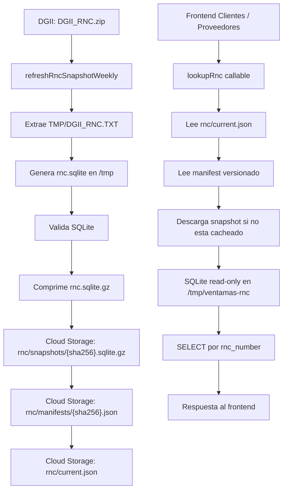

# Especificacion tecnica: Sistema RNC SQLite

Este documento explica el sistema nuevo de consulta RNC basado en snapshots
SQLite generados desde el archivo oficial de DGII. Esta pensado para que un
desarrollador pueda revisar la arquitectura, validar el flujo, operar el
sistema y comparar el comportamiento contra el sistema legacy.

## Resumen ejecutivo

El frontend ya no consulta Supabase como fuente principal de RNC. El camino
normal ahora es:

```text
Frontend
  -> Firebase Callable lookupRnc
  -> SQLite local cacheado en /tmp
  -> Snapshot versionado en Cloud Storage
  -> Archivo oficial DGII
```

SQLite se usa solo en backend. La app no descarga, abre ni sincroniza SQLite.

Supabase queda disponible solo como rollback explicito o como modo shadow de
diagnostico.

## Objetivos del sistema

- Consultar RNC de forma rapida y barata desde backend.
- Evitar depender de Supabase para una tabla grande y de lectura masiva.
- Mantener una fuente centralizada y versionada basada en DGII.
- Permitir rollback seguro sin borrar snapshots anteriores.
- Evitar que el frontend maneje archivos grandes.
- Actualizar automaticamente el snapshot con una tarea programada.

## Componentes principales

| Componente          | Archivo / recurso                                                      | Responsabilidad                                 |
| ------------------- | ---------------------------------------------------------------------- | ----------------------------------------------- |
| Lookup callable     | `functions/src/app/modules/rnc/functions/lookupRnc.js`                 | Recibe consultas RNC desde el frontend          |
| Servicio lookup     | `functions/src/app/modules/rnc/services/rncLookup.service.js`          | Normaliza entrada/salida y consulta repositorio |
| Repositorio SQLite  | `functions/src/app/modules/rnc/services/rncSqlite.repository.js`       | Descarga, cachea y consulta SQLite              |
| Job programado      | `functions/src/app/modules/rnc/functions/refreshRncSnapshotWeekly.js`  | Ejecuta actualizacion automatica                |
| Generador snapshot  | `functions/src/app/modules/rnc/services/rncSnapshotRefresh.service.js` | Descarga DGII, genera SQLite y publica snapshot |
| Manifest utilities  | `functions/src/app/modules/rnc/utils/rncSnapshotManifest.util.js`      | Valida paths, hashes y `current.json`           |
| Frontend repository | `src/modules/contacts/repositories/rnc.repository.ts`                  | Decide si usar backend, legacy o shadow         |
| Runbook existente   | `docs/rnc-sqlite-lookup.md`                                            | Operacion, deploy y rollback                    |

## Arquitectura



## Fuente de datos

La fuente primaria es el archivo oficial descargable de DGII:

```text
https://dgii.gov.do/app/WebApps/Consultas/RNC/DGII_RNC.zip
```

Entrada esperada dentro del ZIP:

```text
TMP/DGII_RNC.TXT
```

La descarga usa headers tipo navegador, incluyendo `User-Agent` y `Referer`,
porque DGII puede rechazar clientes automatizados sin esos headers.

## Layout en Cloud Storage

```text
rnc/
  current.json
  manifests/
    {sha256}.json
  snapshots/
    {sha256}.sqlite.gz

rnc.sqlite.gz
```

`rnc/current.json` es el puntero activo. Indica cual manifest versionado debe
usar el lookup.

`rnc/manifests/{sha256}.json` contiene metadata completa del snapshot:
conteos, hashes, validacion, parser, origen DGII y `snapshotPath`.

`rnc/snapshots/{sha256}.sqlite.gz` contiene snapshots inmutables/versionados.

`rnc.sqlite.gz` queda como fallback legacy deshabilitado por defecto. Solo se
lee cuando no existe `current.json` y
`RNC_SQLITE_ENABLE_LEGACY_FALLBACK=true`; otros errores de manifest, puntero o
snapshot no activan fallback silencioso.

## Por que existe current.json

El sistema no sobrescribe directamente "la base actual". Primero sube un
snapshot nuevo y validado:

```text
rnc/snapshots/{sha256}.sqlite.gz
```

Despues guarda el manifest completo:

```text
rnc/manifests/{sha256}.json
```

Despues publica el puntero:

```text
rnc/current.json
```

Eso permite cambiar de version de forma controlada.

Si un snapshot falla:

```text
current.json no cambia
lookupRnc sigue usando el snapshot anterior
```

Si hay que hacer rollback:

```text
current.json vuelve a apuntar al manifest anterior
```

## Ejemplo conceptual de current.json

```json
{
  "schemaVersion": 1,
  "manifestPath": "rnc/manifests/aaaaaaaaaaaaaaaaaaaaaaaaaaaaaaaaaaaaaaaaaaaaaaaaaaaaaaaaaaaaaaaa.json",
  "sha256": "aaaaaaaaaaaaaaaaaaaaaaaaaaaaaaaaaaaaaaaaaaaaaaaaaaaaaaaaaaaaaaaa",
  "snapshotGzipSha256": "aaaaaaaaaaaaaaaaaaaaaaaaaaaaaaaaaaaaaaaaaaaaaaaaaaaaaaaaaaaaaaaa",
  "activatedAt": "2026-06-18T02:21:10.000Z",
  "activationReason": "publish",
  "rejectedSha256List": []
}
```

Para rollback se usa el mismo contrato, cambiando `activationReason` a
`rollback`. Si se necesita evitar que el scheduler reprograme de inmediato, el
puntero puede incluir `rollbackHoldUntil` y/o `rejectedSha256List`.

## Ejemplo conceptual de manifest versionado

```json
{
  "schemaVersion": 1,
  "manifestPath": "rnc/manifests/aaaaaaaaaaaaaaaaaaaaaaaaaaaaaaaaaaaaaaaaaaaaaaaaaaaaaaaaaaaaaaaa.json",
  "snapshotPath": "rnc/snapshots/aaaaaaaaaaaaaaaaaaaaaaaaaaaaaaaaaaaaaaaaaaaaaaaaaaaaaaaaaaaaaaaa.sqlite.gz",
  "sha256": "aaaaaaaaaaaaaaaaaaaaaaaaaaaaaaaaaaaaaaaaaaaaaaaaaaaaaaaaaaaaaaaa",
  "snapshotGzipSha256": "aaaaaaaaaaaaaaaaaaaaaaaaaaaaaaaaaaaaaaaaaaaaaaaaaaaaaaaaaaaaaaaa",
  "parserVersion": "2026-06-18.1",
  "expectedFieldCount": 11,
  "rowCount": 779468,
  "validSourceRows": 779500,
  "duplicateRncCount": 32,
  "duplicateRncRatio": 0.000041,
  "maxDuplicateRncRatio": 0.01,
  "maxDuplicateRncRatioIncrease": 0.005,
  "skippedRows": 0,
  "generatedAt": "2026-06-18T02:20:48.000Z",
  "manifestCreatedAt": "2026-06-18T02:20:48.000Z",
  "sqliteBytes": 268435456,
  "sqliteSha256": "dddddddddddddddddddddddddddddddddddddddddddddddddddddddddddddddd",
  "sqliteGzipBytes": 73400320,
  "source": {
    "type": "dgii-rnc-zip",
    "url": "https://dgii.gov.do/app/WebApps/Consultas/RNC/DGII_RNC.zip",
    "entryName": "TMP/DGII_RNC.TXT",
    "zipSha256": "bbbbbbbbbbbbbbbbbbbbbbbbbbbbbbbbbbbbbbbbbbbbbbbbbbbbbbbbbbbbbbbb",
    "textSha256": "cccccccccccccccccccccccccccccccccccccccccccccccccccccccccccccccc"
  },
  "validation": {
    "quickCheck": "ok",
    "rowCount": 779468,
    "minimumRowCount": 500000,
    "qualityMetrics": {
      "nullConditionRows": 0,
      "nullFullNameRows": 0,
      "nullStatusRows": 0
    }
  },
  "previousComparison": {
    "previousRowCount": 779000,
    "previousDuplicateRncCount": 30,
    "previousDuplicateRncRatio": 0.000039,
    "duplicateRncRatioIncrease": 0.000002,
    "maxDuplicateRncRatioIncrease": 0.005,
    "rowCountDropRatio": 0,
    "rowCountIncreaseRatio": 0.0006,
    "maxRowCountDropRatio": 0.15,
    "maxRowCountIncreaseRatio": 0.3
  }
}
```

Los valores anteriores son ilustrativos. El sistema valida que el puntero y el
manifest tengan estructura coherente antes de publicarlos.

`snapshotGzipSha256` es el hash canonico del archivo
`rnc/snapshots/{hash}.sqlite.gz`. El campo `sha256` se mantiene como alias de
compatibilidad. `sqliteSha256` representa el SQLite descomprimido.

## Flujo de actualizacion automatica

La funcion exportada se llama:

```text
refreshRncSnapshotWeekly
```

Aunque conserva ese nombre, el schedule actual corre diario:

```text
03:30 America/Santo_Domingo
```

Configuracion principal:

```text
schedule: 30 3 * * *
timeZone: America/Santo_Domingo
memory: 4GiB
timeoutSeconds: 540
maxInstances: 1
concurrency: 1
retryCount: 1
```

El timeout efectivo de descarga DGII tiene default `240000` ms y se capa para
reservar al menos 4 minutos del timeout total para extraer, generar SQLite,
validar, comprimir y publicar. Aunque se configure
`RNC_DGII_DOWNLOAD_TIMEOUT_MS=480000`, el runtime no usa mas de `300000` ms
para la descarga dentro de esta funcion de 540 segundos.

Flujo completo:

```text
1. Cloud Scheduler dispara refreshRncSnapshotWeekly.
2. La funcion lee rnc/current.json si existe.
3. Descarga DGII_RNC.zip.
4. Calcula SHA-256 del ZIP.
5. Si el ZIP no cambio y el manifest actual es reutilizable, termina skipped.
6. Extrae TMP/DGII_RNC.TXT.
7. Calcula SHA-256 del TXT.
8. Si el TXT no cambio, termina skipped.
9. Genera rnc.sqlite en /tmp.
10. Valida la base SQLite.
11. Comprime rnc.sqlite a rnc.sqlite.gz.
12. Calcula SHA-256 del SQLite y del gzip.
13. Sube rnc/snapshots/{snapshotGzipSha256}.sqlite.gz con ifGenerationMatch=0
    porque el objeto versionado debe ser inexistente en una publicacion nueva.
14. Si el snapshot ya existe por un retry idempotente, valida que bytes y hash
    coincidan antes de reutilizarlo.
15. Sube rnc/manifests/{snapshotGzipSha256}.json con ifGenerationMatch=0
    porque el manifest versionado tambien debe ser inexistente.
16. Si el manifest ya existe por un retry idempotente, valida sus campos
    criticos antes de reutilizarlo.
17. Publica rnc/current.json con ifGenerationMatch igual a la generacion leida,
    o con 0 solo si se confirmo que current.json no existe.
18. Si current.json cambio mientras tanto, solo acepta el conflicto si ya
    apunta al mismo manifest/hash.
19. Limpia archivos temporales.
```

## Validacion antes de publicar

Antes de que `current.json` apunte a un snapshot nuevo, se valida:

```text
ZIP valido
Entrada esperada dentro del ZIP
TXT no vacio
Limites maximos de ZIP, TXT y SQLite
RNC parseables
Minimo de registros esperado
PRAGMA quick_check
RNC conocidos presentes
Registros canario con nombre, estado y condicion esperados cuando se configuran
Hashes SHA-256
Tamanos del SQLite y gzip
Conteo esperado de campos del TXT
Limite de filas omitidas
Limite maximo de aumento y caida de filas contra el manifest anterior
Conteo de RNC duplicados y filas fuente validas
Metricas de campos nulos
Version del parser
PRAGMA user_version compatible
PRAGMA query_only en validacion/lectura
Ausencia de WAL, SHM o journal pendientes antes de comprimir
Manifest valido
Hash no marcado como rechazado
Rollback hold no activo
```

El minimo de filas por defecto es:

```text
500000
```

Si cualquier validacion falla, el snapshot no se publica como actual.

## Validacion de cambios del archivo DGII

El sistema si descarga el ZIP para poder hashearlo. Lo que evita es procesar,
regenerar y subir snapshot cuando DGII no cambio.

Casos:

```text
ZIP igual
  -> skipped: source-zip-unchanged
  -> no genera SQLite
  -> no sube snapshot
  -> no cambia current.json
```

```text
ZIP diferente pero TXT interno igual
  -> skipped: source-text-unchanged
  -> no genera SQLite
  -> no sube snapshot
  -> no cambia current.json
```

```text
TXT diferente
  -> genera SQLite
  -> valida
  -> sube snapshot nuevo
  -> actualiza current.json
```

## Reuso, skip y parserVersion

Un manifest anterior solo puede reutilizarse para saltar trabajo si sigue
representando el mismo contrato de parser y validacion. El refresh puede
terminar con `source-zip-unchanged`, `source-text-unchanged` o
`snapshot-unchanged` solo cuando el manifest actual es versionado y mantiene:

```text
validation.quickCheck: ok
expectedEntryName igual al configurado
minimumRowCount igual al configurado
rowCount mayor o igual al minimo
canarios RNC y registros de validacion iguales a los configurados
duplicateRncCount/duplicateRncRatio dentro de los limites actuales
parserVersion igual al parser del runtime
```

`parserVersion` invalida reuse/skip. Cuando cambie `RNC_PARSER_VERSION`, el
siguiente refresh debe regenerar el SQLite aunque el ZIP o TXT de DGII tenga el
mismo hash. Esto evita que una version vieja del parser bloquee una publicacion
nueva por `source-zip-unchanged`, `source-text-unchanged` o
`snapshot-unchanged`.

## Memoria, ZIP y determinismo operativo

El refresh usa `memory: 4GiB`, `timeoutSeconds: 540`, `concurrency: 1` y
`maxInstances: 1`. La descarga del ZIP aplica limite durante el stream; luego
se valida el central directory para rechazar entradas inesperadas, duplicadas,
absolutas, con `..`, ZIP64, symlinks o compresion no soportada. La extraccion
del TXT esperado tambien aplica limite durante el stream. El trabajo pesado de
SQLite y gzip ocurre en archivos temporales bajo `/tmp`.

El lookup usa `memory: 2GiB` y descarga el snapshot por stream desde Cloud
Storage hacia `/tmp/ventamas-rnc/`, calculando el hash del gzip y el hash del
SQLite descomprimido durante el pipeline. Requests simultaneos del mismo
snapshot comparten una sola promesa de descarga por instancia.

El gzip del snapshot se genera con `level: 9` y `mtime: 0`, de modo que el mismo
SQLite produce bytes gzip estables. El hash canonico del objeto versionado es el
SHA-256 del gzip, y el manifest tambien conserva `sqliteSha256` para el SQLite
descomprimido.

La publicacion es idempotente pero no permite sobrescribir contenido distinto:
si el snapshot o manifest versionado ya existe, el runtime compara bytes,
hashes y campos criticos antes de reutilizarlo. `rnc/current.json` no usa
creacion exclusiva salvo cuando no existe; para reemplazarlo se usa la
generacion leida.

## Duplicados DGII

El parser procesa el archivo en orden. Cada fila valida se normaliza y se
inserta con `INSERT OR REPLACE`; si el mismo RNC aparece mas de una vez, gana la
ultima fila valida del archivo. El manifest separa tres metricas:

```text
validSourceRows: filas fuente validas antes de deduplicar
duplicateRncCount: filas validas cuyo RNC ya habia aparecido
rowCount: RNC unicos finales en SQLite
```

Guardrails configurables:

```text
RNC_SNAPSHOT_MAX_DUPLICATE_RNC_RATIO
  default: 0.01
  significado: duplicateRncCount / validSourceRows no puede superar 1%

RNC_SNAPSHOT_MAX_DUPLICATE_RNC_RATIO_INCREASE
  default: 0.005
  alias: RNC_SNAPSHOT_MAX_DUPLICATE_RNC_INCREASE_RATIO
  significado: el ratio de duplicados no puede subir mas de 0.5 puntos contra
  el manifest anterior

RNC_SNAPSHOT_MAX_DUPLICATE_RNC_COUNT
  default: sin limite absoluto
  alias: RNC_SNAPSHOT_MAX_DUPLICATE_RNC_ROWS
  significado: si se define, duplicateRncCount no puede superar ese numero
```

El manifest nuevo persiste `duplicateRncRatio`,
`maxDuplicateRncRatio`, `maxDuplicateRncRatioIncrease` y, solo cuando se
configura, `maxDuplicateRncCount`. `previousComparison` conserva el ratio y
conteo anterior para auditoria.

## Esquema SQLite

La base se genera con:

```sql
PRAGMA user_version = 1;
```

El runtime valida esa version antes de consultar.

## Parser DGII

Politica actual del parser:

```text
TXT .txt: Windows-1252
CSV u otras entradas .csv: UTF-8
Delimitador: pipe |
Comillas: no se interpretan como CSV; se preservan como texto del campo
Columnas esperadas: exactamente 11
Columnas adicionales o faltantes: fila omitida y contada en skippedRows
RNC duplicados: INSERT OR REPLACE; gana la ultima fila valida del archivo
Espacios: se recortan al mapear campos; raw_fields_json conserva campos recortados
Saltos dentro de campos: no soportados; el archivo DGII se procesa por lineas
field_6 y field_7: campos DGII sin significado funcional confirmado; se preservan
parserVersion: cambio incompatible invalida reuse/skip y fuerza regeneracion
Maxima caida de filas: RNC_SNAPSHOT_MAX_ROW_COUNT_DROP_RATIO
Maximo aumento de filas: RNC_SNAPSHOT_MAX_ROW_COUNT_INCREASE_RATIO
Maximo ratio de duplicados: RNC_SNAPSHOT_MAX_DUPLICATE_RNC_RATIO
Maximo aumento de ratio de duplicados: RNC_SNAPSHOT_MAX_DUPLICATE_RNC_RATIO_INCREASE
Maximo conteo absoluto de duplicados: RNC_SNAPSHOT_MAX_DUPLICATE_RNC_COUNT
status y condition: se validan con canarios configurables y metricas de nulos
rowCount: RNC unicos finales en SQLite, no filas fuente
validSourceRows: filas fuente validas antes de deduplicar
duplicateRncCount: filas validas cuyo RNC ya habia aparecido en el archivo
```

Tabla:

```sql
CREATE TABLE rnc (
  rnc_number TEXT PRIMARY KEY,
  full_name TEXT,
  business_name TEXT,
  business_activity TEXT,
  category TEXT,
  payment_regime TEXT,
  field_6 TEXT,
  field_7 TEXT,
  registration_date TEXT,
  status TEXT,
  condition TEXT,
  raw_fields_json TEXT,
  source_updated_at TEXT
);
```

Consulta principal:

```sql
SELECT
  rnc_number,
  full_name,
  business_name,
  business_activity,
  category,
  payment_regime,
  field_6,
  field_7,
  registration_date,
  status,
  condition,
  raw_fields_json,
  source_updated_at
FROM rnc
WHERE rnc_number = ?
LIMIT 1;
```

## Flujo de consulta runtime

Cuando el usuario busca un RNC:

```text
1. El usuario escribe el RNC en clientes o proveedores.
2. El frontend llama fetchRncRecordByNumber.
3. El repository frontend resuelve la fuente.
4. Por defecto usa lookupRnc.
5. lookupRnc valida autenticacion/session token.
6. lookupRnc aplica rate limit.
7. Normaliza el RNC.
8. El repositorio lee rnc/current.json.
9. Si no hay SQLite local para ese snapshot, descarga el gzip.
10. Hace stream: Storage -> sha256 gzip -> gunzip -> sha256 SQLite -> archivo temporal.
11. Valida hash/tamano, renombra a cache local y abre SQLite read-only.
12. Relee current.json antes de activar el descargado.
13. Activa el nuevo SQLite solo si el puntero sigue siendo el esperado.
14. Si la activacion falla, conserva el ultimo SQLite valido.
15. Ejecuta SELECT por rnc_number.
16. Devuelve record normalizado.
```

## Cache en backend

El cache vive por instancia de Firebase Functions.

Directorio local:

```text
/tmp/ventamas-rnc/
```

Comportamiento:

```text
Cold start:
  descarga snapshot actual
  descomprime SQLite
  abre conexion read-only

Requests siguientes:
  reutilizan SQLite local y statement preparado

Requests simultaneos del mismo snapshot:
  comparten una unica promesa de descarga/descompresion por SHA

Cada 15 minutos:
  revisa current.json
  si cambio el snapshot, descarga y abre el nuevo

Intercambio de version:
  abre y valida el SQLite nuevo antes de publicar la referencia local
  conserva el SQLite anterior hasta que no haya consultas activas
  borra temporales y caches inactivos como best-effort
```

TTL por defecto:

```text
RNC_SQLITE_CACHE_TTL_MS=900000
```

## Contrato de lookupRnc

Payload:

```json
{
  "rnc": "101027797"
}
```

Tambien acepta campos alternativos:

```text
rnc
rncNumber
rnc_number
identificationNumber
value
```

Respuesta encontrada:

```json
{
  "ok": true,
  "found": true,
  "status": "found",
  "source": "storage-sqlite",
  "rnc_number": "101027797",
  "full_name": "3 M DOMINICANA SRL",
  "lastUpdated": "2026-06-18T02:20:48.000Z",
  "record": {
    "rnc_number": "101027797",
    "full_name": "3 M DOMINICANA SRL",
    "business_name": null,
    "status": "ACTIVO",
    "condition": "NORMAL"
  },
  "data": {
    "rnc_number": "101027797",
    "full_name": "3 M DOMINICANA SRL"
  }
}
```

Respuesta no encontrada:

```json
{
  "ok": true,
  "found": false,
  "status": "not_found_in_contributors_snapshot",
  "source": "storage-sqlite",
  "rnc_number": "101204097",
  "full_name": null,
  "record": null,
  "data": null
}
```

`not_found_in_contributors_snapshot` no significa necesariamente que el RNC sea
invalido. Significa que no aparece en el snapshot descargable de contribuyentes
usado por el sistema.

`record` es la forma canonica para consumidores nuevos. `data`, `rnc_number` y
`full_name` se conservan por compatibilidad con consumidores existentes.

## Validacion de entrada

El RNC se normaliza aceptando `string`. No se acepta `number` como contrato
publico porque puede perder ceros iniciales.

Reglas:

```text
Requerido
Solo digitos, espacios o guiones
Longitud normalizada exactamente 9 u 11 digitos
```

Errores de validacion devuelven `invalid-argument` en el callable.

## Seguridad

`lookupRnc` requiere autenticacion/session token via:

```text
resolveCallableAuthUid
```

Ademas tiene rate limit en memoria:

```text
120 consultas por minuto
```

Para produccion puede activar limite distribuido entre instancias:

```text
RNC_LOOKUP_DISTRIBUTED_RATE_LIMIT=true
```

Por defecto el limite distribuido falla cerrado si Firestore no permite validar
el bucket. Solo debe fallar abierto si se define explicitamente:

```text
RNC_LOOKUP_DISTRIBUTED_RATE_LIMIT_FAIL_OPEN=true
```

La llave del rate limit intenta usar:

```text
auth uid resuelto
app id
IP
x-forwarded-for
```

En el flujo normal `lookupRnc` exige `authUid` antes de aplicar rate limit, por
lo que el UID resuelto es la fuente primaria. En Firestore no se guarda el UID,
IP ni `x-forwarded-for` en claro: se almacena `keyHash` y el documento usa otro
hash por ventana.

App Check esta preparado por variables:

```text
RNC_LOOKUP_ENFORCE_APP_CHECK
RNC_LOOKUP_CONSUME_APP_CHECK_TOKEN
```

Storage Rules deben negar lectura/escritura cliente sobre `rnc/**`. Solo el
backend con IAM debe leer `rnc/current.json`, `rnc/manifests/**` y
`rnc/snapshots/**`. El objeto raiz `rnc.sqlite.gz` tambien debe estar negado al
cliente.

La concurrencia del callable se controla con:

```text
RNC_LOOKUP_CONCURRENCY
```

El escalado maximo se controla con:

```text
RNC_LOOKUP_MAX_INSTANCES
```

Valores por defecto:

```text
memory: 2GiB
timeoutSeconds: 180
concurrency: 20
maxInstances: 10
```

`RNC_LOOKUP_CONCURRENCY` se acepta solo entre `1` y `80`.
`RNC_LOOKUP_MAX_INSTANCES` se acepta solo entre `1` y `100`. Valores invalidos
vuelven al default.

## Frontend

Archivo principal:

```text
src/modules/contacts/repositories/rnc.repository.ts
```

Por defecto usa backend. El interruptor operativo recomendado es Firebase
Remote Config con la llave:

```text
rnc_lookup_source
```

Valores aceptados:

```text
backend
legacy-supabase
shadow
```

La variable `VITE_RNC_LOOKUP_SOURCE` queda como fallback compilado. Cambiarla
en produccion requiere rebuild y redeploy del frontend.

Fallback de build:

```text
VITE_RNC_LOOKUP_SOURCE no definido -> backend
VITE_RNC_LOOKUP_SOURCE=backend -> backend
VITE_RNC_LOOKUP_SOURCE=firebase -> backend
```

Rollback legacy:

```text
VITE_RNC_LOOKUP_SOURCE=legacy-supabase
```

Alias legacy:

```text
VITE_RNC_LOOKUP_SOURCE=legacy
```

Modo shadow:

```text
VITE_RNC_LOOKUP_SOURCE=shadow
```

En modo shadow:

```text
consulta Supabase
consulta lookupRnc
compara en consola si hay diferencias
devuelve Supabase
```

## Supabase legacy

Supabase ya no debe ser la fuente principal. Queda para:

```text
Rollback explicito
Diagnostico shadow
Comparacion temporal
```

No hay fallback silencioso desde backend hacia Supabase. Si backend falla en
modo `backend`, se debe ver el error en lugar de ocultarlo.

## Variables backend relevantes

```powershell
$env:RNC_LOOKUP_SOURCE = 'storage-sqlite'
$env:RNC_SQLITE_BUCKET = 'bucket-opcional'
$env:RNC_SQLITE_STORAGE_PATH = 'rnc.sqlite.gz'
$env:RNC_SQLITE_TABLE = 'rnc'
$env:RNC_SQLITE_RNC_COLUMN = 'rnc_number'
$env:RNC_SQLITE_CACHE_TTL_MS = '900000'
$env:RNC_SQLITE_MAX_BYTES = '536870912'
$env:RNC_SQLITE_ENABLE_LEGACY_FALLBACK = 'false'
$env:RNC_CURRENT_MANIFEST_PATH = 'rnc/current.json'
$env:RNC_SNAPSHOT_PREFIX = 'rnc/snapshots'
$env:RNC_SNAPSHOT_MANIFEST_PREFIX = 'rnc/manifests'
$env:RNC_SNAPSHOT_SKIP_UNCHANGED_ZIP = 'true'
$env:RNC_SNAPSHOT_MIN_ROW_COUNT = '500000'
$env:RNC_SNAPSHOT_MAX_SKIPPED_ROWS = '1000'
$env:RNC_SNAPSHOT_MAX_ROW_COUNT_DROP_RATIO = '0.15'
$env:RNC_SNAPSHOT_MAX_ROW_COUNT_INCREASE_RATIO = '0.3'
$env:RNC_SNAPSHOT_MAX_DUPLICATE_RNC_RATIO = '0.01'
$env:RNC_SNAPSHOT_MAX_DUPLICATE_RNC_RATIO_INCREASE = '0.005'
$env:RNC_SNAPSHOT_MAX_DUPLICATE_RNC_COUNT = ''
$env:RNC_SNAPSHOT_MAX_SQLITE_BYTES = '536870912'
$env:RNC_SNAPSHOT_MAX_NULL_FULL_NAME_ROWS = '0'
$env:RNC_SNAPSHOT_MAX_NULL_STATUS_ROWS = '0'
$env:RNC_SNAPSHOT_MAX_NULL_CONDITION_ROWS = '1000'
$env:RNC_SNAPSHOT_REJECTED_SHA256_LIST = ''
$env:RNC_SNAPSHOT_ROLLBACK_HOLD_UNTIL = ''
$env:RNC_SNAPSHOT_VALIDATE_RNCS = '401506254,101027797,101000155'
$env:RNC_SNAPSHOT_VALIDATE_RECORDS_JSON = '[{"rnc":"101027797","full_name":"3 M DOMINICANA SRL","status":"ACTIVO","condition":"NORMAL"}]'
$env:RNC_DGII_DOWNLOAD_TIMEOUT_MS = '240000'
$env:RNC_DGII_EXPECTED_ENTRY = 'TMP/DGII_RNC.TXT'
$env:RNC_DGII_MAX_TEXT_BYTES = '536870912'
$env:RNC_DGII_MAX_ZIP_BYTES = '134217728'
$env:RNC_DGII_SOURCE_URL = 'https://dgii.gov.do/app/WebApps/Consultas/RNC/DGII_RNC.zip'
$env:RNC_LOOKUP_RATE_LIMIT_MAX = '120'
$env:RNC_LOOKUP_RATE_LIMIT_WINDOW_MS = '60000'
$env:RNC_LOOKUP_DISTRIBUTED_RATE_LIMIT = 'true'
$env:RNC_LOOKUP_DISTRIBUTED_RATE_LIMIT_FAIL_OPEN = 'false'
$env:RNC_LOOKUP_CONCURRENCY = '20'
$env:RNC_LOOKUP_MAX_INSTANCES = '10'
$env:RNC_LOOKUP_ENFORCE_APP_CHECK = 'true'
```

Aliases backend aceptados por compatibilidad:

```powershell
$env:RNC_SNAPSHOT_MAX_DUPLICATE_RNC_INCREASE_RATIO = '0.005'
$env:RNC_SNAPSHOT_MAX_DUPLICATE_RNC_ROWS = ''
$env:RNC_SNAPSHOT_MIN_ROWS = '500000'
$env:RNC_DGII_EXPECTED_ENTRY_NAME = 'TMP/DGII_RNC.TXT'
$env:RNC_SNAPSHOT_KNOWN_RNCS = '401506254,101027797,101000155'
$env:RNC_SNAPSHOT_CURRENT_PATH = 'rnc/current.json'
$env:RNC_CURRENT_METADATA_PATH = 'rnc/current.json'
$env:RNC_SNAPSHOT_METADATA_PATH = 'rnc/current.json'
$env:RNC_LOOKUP_SQLITE_OBJECT = 'rnc.sqlite.gz'
```

## Variables frontend relevantes

```powershell
$env:VITE_RNC_LOOKUP_SOURCE = 'backend'
$env:VITE_RNC_LOOKUP_SOURCE = 'legacy-supabase'
$env:VITE_RNC_LOOKUP_SOURCE = 'shadow'
$env:VITE_RNC_LOOKUP_SOURCE_REMOTE_KEY = 'rnc_lookup_source'
$env:VITE_FIREBASE_APPCHECK_SITE_KEY = 'recaptcha-enterprise-site-key'
```

## Comandos de validacion

```powershell
npm run test:run:functions -- functions/src/app/modules/rnc functions/src/index.exportSurface.test.js functions/src/index.importGraph.test.js
npm run test:run -- src/modules/contacts/repositories/rnc.repository.test.ts src/modules/contacts/hooks/useRncSearch.test.ts
npm --prefix functions run build
npm run typecheck:app
```

## Deploy selectivo

Si se modifican Functions, desplegar solo las funciones afectadas.

Staging con helper:

```powershell
npm run deploy -- staging:functions lookupRnc,refreshRncSnapshotWeekly
```

Produccion con helper:

```powershell
npm run deploy -- prod:functions lookupRnc,refreshRncSnapshotWeekly
```

Firebase directo para staging:

```powershell
firebase deploy --project staging --only "functions:lookupRnc,functions:refreshRncSnapshotWeekly"
```

Firebase directo para produccion:

```powershell
firebase deploy --project prod --only "functions:lookupRnc,functions:refreshRncSnapshotWeekly"
```

## Ejecucion manual del job

Para generar o refrescar snapshot manualmente despues de un deploy:

```powershell
gcloud scheduler jobs run firebase-schedule-refreshRncSnapshotWeekly-us-central1 --location us-central1 --project ventamax-staging
```

Produccion:

```powershell
gcloud scheduler jobs run firebase-schedule-refreshRncSnapshotWeekly-us-central1 --location us-central1 --project ventamaxpos
```

Listar jobs si cambia la region o el nombre:

```powershell
gcloud scheduler jobs list --location us-central1 --project ventamax-staging --filter="name:refreshRncSnapshotWeekly"
```

## Inspeccion operativa

Ver manifest actual:

```powershell
gcloud storage cat gs://ventamax-staging.firebasestorage.app/rnc/current.json
```

Listar manifests y snapshots:

```powershell
gcloud storage ls gs://ventamax-staging.firebasestorage.app/rnc/manifests/
gcloud storage ls gs://ventamax-staging.firebasestorage.app/rnc/snapshots/
```

Ver logs de lookup:

```powershell
firebase functions:log --project ventamax-staging --only lookupRnc
```

Ver logs del refresh:

```powershell
firebase functions:log --project ventamax-staging --only refreshRncSnapshotWeekly
```

## Operacion produccion

Recomendaciones antes de produccion:

```text
lookupRnc service account:
  lectura sobre rnc/current.json
  lectura sobre rnc/manifests/**
  lectura sobre rnc/snapshots/**
  si RNC_LOOKUP_DISTRIBUTED_RATE_LIMIT=true:
    lectura/escritura transaccional sobre runtimeRateLimits/rncLookup/rncLookupBuckets/*

refresh service account:
  lectura/escritura sobre rnc/current.json
  lectura/escritura sobre rnc/manifests/**
  lectura/escritura sobre rnc/snapshots/**
```

Alertas recomendadas:

```text
refresh sin ok=true por 26h: warning; por 36h: critico
duracion refresh > 8min: warning; timeout/fallo: critico
current.json/manifest/snapshot/hash inconsistente: critico
validation.quickCheck distinto de ok: critico
rowCountDropRatio > 0.10: warning; > 0.15: critico
rowCountIncreaseRatio > 0.20: warning; > 0.30: critico
skippedRows > 0: warning; > 1000: critico
duplicateRncRatio > 0.005: warning; > 0.01: critico
duplicateRncRatioIncrease > 0.002: warning; > 0.005: critico
duplicateRncCount > 80% de RNC_SNAPSHOT_MAX_DUPLICATE_RNC_COUNT: warning
nullFullNameRows o nullStatusRows > 0: critico
nullConditionRows > 500: warning; > 1000: critico
lookupRnc internal/failed-precondition/unavailable > 1% por 5min: warning
lookupRnc internal/failed-precondition/unavailable > 5% por 5min: critico
resource-exhausted > 2% o > 10/min: warning; > 50/min: critico
uso del fallback legacy rnc.sqlite.gz: critico
latencyMs caliente p95 > 500ms o p99 > 1500ms: warning
activacion fria > 120s: critico
```

SLO recomendado:

```text
lookupRnc disponibilidad mensual >= 99.5% para found/not_found
lookupRnc latencia caliente p95 < 500ms y p99 < 1500ms
lookupRnc activacion fria p95 < 30s y p99 < 60s
refresh diario registra ok=true, completado o skipped, dentro de 26h
```

Retencion recomendada:

```text
proteger siempre current.json
proteger siempre el manifest actual
proteger siempre el snapshot actual
conservar varios manifests/snapshots anteriores para rollback
borrar solo objetos no referenciados por current.json ni por ventana de rollback
```

Si `RNC_LOOKUP_DISTRIBUTED_RATE_LIMIT=true`, configurar TTL de Firestore sobre:

```text
runtimeRateLimits/rncLookup/rncLookupBuckets/* -> resetAt
```

## Pruebas pendientes antes de produccion

Estas pruebas deben ejecutarse con evidencia antes de marcar el sistema como
estable en produccion:

```text
carga lookup caliente:
  200 requests concurrentes por 15 minutos
  mezcla de RNC existentes y no encontrados
  p95 < 500ms
  error rate < 0.5%, excluyendo invalid-argument

activacion fria:
  al menos 50 requests simultaneos despues de cold start/deploy
  una descarga por instancia, no una por request
  sin OOM, SQLITE_BUSY ni colisiones en /tmp/ventamas-rnc

cambio de snapshot bajo trafico:
  actualizar current.json mientras hay consultas
  confirmar que el SQLite anterior sigue sirviendo hasta activar el nuevo
  confirmar hash, quick_check y user_version antes de publicar referencia local

rate limit distribuido:
  varias instancias con la misma llave
  limite global 120/min
  fail-closed si Firestore no permite validar
  usuarios distintos no deben bloquearse entre si

carreras de publicacion:
  scheduler retry y run manual en paralelo
  CAS correcto de current.json
  retry idempotente de snapshot/manifest versionado
  conflicto por generacion obsoleta sin perdida de update
  rollbackHoldUntil y rejectedSha256List respetados

limites de archivo:
  ZIP cercano a 128MiB
  TXT cercano a 512MiB
  SQLite cercano a 512MiB
  timeout total < 540s
  memoria bajo 4GiB

fallos externos:
  DGII 403/timeout
  ZIP corrupto o entrada inesperada
  manifest corrupto
  snapshot corrupto
  current.json no debe cambiar y lookup conserva ultimo SQLite valido
```

## Rollback recomendado

El rollback preferido es mover `current.json` a un manifest versionado anterior.

Ejemplo:

```powershell
$hash = 'aaaaaaaaaaaaaaaaaaaaaaaaaaaaaaaaaaaaaaaaaaaaaaaaaaaaaaaaaaaaaaaa'
$badHash = 'bbbbbbbbbbbbbbbbbbbbbbbbbbbbbbbbbbbbbbbbbbbbbbbbbbbbbbbbbbbbbbbb'
$manifestObject = "gs://ventamax-staging.firebasestorage.app/rnc/manifests/$hash.json"
$snapshotObject = "gs://ventamax-staging.firebasestorage.app/rnc/snapshots/$hash.sqlite.gz"
gcloud storage objects describe $manifestObject --format=json | Out-Null
gcloud storage objects describe $snapshotObject --format=json | Out-Null
node tools/rnc/validate-rollback-target.mjs --bucket gs://ventamax-staging.firebasestorage.app --hash $hash
node tools/rnc/prepare-rollback-pointer.mjs --bucket gs://ventamax-staging.firebasestorage.app --hash $hash --reject-hash $badHash --rollback-hold-hours 12 --publish
```

Para inspeccionar antes de publicar:

```powershell
$tmp = Join-Path $env:TEMP 'rnc-current-rollback.json'
node tools/rnc/prepare-rollback-pointer.mjs --bucket gs://ventamax-staging.firebasestorage.app --hash $hash --reject-hash $badHash --rollback-hold-hours 12 --output $tmp
Get-Content -Raw -Path $tmp
```

La herramienta lee `rnc/current.json`, une su `rejectedSha256List` existente con
`--reject-hash`, preserva `rollbackHoldUntil` salvo que se pase
`--rollback-hold-until`, `--rollback-hold-hours` o `--clear-rollback-hold`, y
escribe JSON UTF-8 sin BOM. Con `--publish`, publica con CAS usando la
generacion leida de `current.json` y falla si el objeto cambia durante la
lectura. Esto reemplaza el bloque manual con `Get-GcsObjectGenerationOrZero` y
equivale al control `gcloud storage cp $tmp $currentObject
--if-generation-match=$currentGeneration`; `$currentGeneration` debe ser la
generacion real cuando `rnc/current.json` existe. Solo debe ser `0` si el
`describe` confirmo que el objeto no existe. Usar `0` contra un objeto existente
no es rollback seguro; es una condicion de creacion exclusiva.

Despues del rollback:

```text
Esperar hasta 15 minutos por el TTL de cache
o hacer deploy selectivo de lookupRnc para forzar cold starts
mantener rollbackHoldUntil o rejectedSha256List hasta aprobar una nueva publicacion
```

Fallback legacy. Resolver la generacion del objeto antes de copiar; esto
reemplaza el helper conceptual `Get-GcsObjectGenerationOrZero` para la
precondicion CAS del objeto legacy:

```powershell
$legacyObject = 'gs://ventamax-staging.firebasestorage.app/rnc.sqlite.gz'
$snapshotObject = 'gs://ventamax-staging.firebasestorage.app/rnc/snapshots/aaaaaaaaaaaaaaaaaaaaaaaaaaaaaaaaaaaaaaaaaaaaaaaaaaaaaaaaaaaaaaaa.sqlite.gz'
gcloud storage objects describe $snapshotObject --format=json | Out-Null
$errorFile = New-TemporaryFile
try {
  $legacyGeneration = gcloud storage objects describe $legacyObject --format='value(generation)' 2>$errorFile
  if ($LASTEXITCODE -ne 0) {
    $message = Get-Content -Path $errorFile -Raw
    if ($message -notmatch '(?i)(404|not found|No URLs matched)') {
      throw "No se pudo leer $legacyObject. gcloud exit=$LASTEXITCODE. $message"
    }
    $legacyGeneration = '0'
  }
} finally {
  Remove-Item -LiteralPath $errorFile -Force -ErrorAction SilentlyContinue
}
gcloud storage cp $snapshotObject $legacyObject --if-generation-match=$legacyGeneration
```

El fallback legacy solo se usa si `current.json` no existe y
`RNC_SQLITE_ENABLE_LEGACY_FALLBACK=true`; copiar `rnc.sqlite.gz` no cambia la
version activa mientras exista `rnc/current.json`. Para el objeto legacy,
`--if-generation-match=0` solo aplica cuando `rnc.sqlite.gz` no existe; si
existe, usar su generacion actual.

## Estados esperados

Lookup encontrado:

```text
ok: true
found: true
status: found
source: storage-sqlite
```

Lookup no encontrado:

```text
ok: true
found: false
status: not_found_in_contributors_snapshot
source: storage-sqlite
```

Repositorio no disponible:

```text
ok: false
status: unavailable
source: unavailable
```

Refresh sin cambios:

```text
ok: true
skipped: true
skipReason: source-zip-unchanged
```

o:

```text
ok: true
skipped: true
skipReason: source-text-unchanged
```

Refresh exitoso:

```text
ok: true
rowCount: mayor o igual al minimo
storagePath: rnc/snapshots/{sha256}.sqlite.gz
currentPath: rnc/current.json
metadataPath: rnc/manifests/{sha256}.json
```

## Limitaciones conocidas

- El sistema depende del archivo descargable de DGII.
- No todos los RNC o cedulas existentes necesariamente aparecen en ese
  snapshot.
- `not_found_in_contributors_snapshot` no debe mostrarse como "RNC invalido"
  sin contexto adicional.
- La ubicacion no es actualmente el criterio principal del lookup ni se muestra
  como campo principal en el panel RNC.
- La funcion descarga el ZIP para comparar hashes; el ahorro ocurre al no
  regenerar SQLite ni subir snapshot si no hubo cambios.
- Las instancias calientes pueden tardar hasta el TTL configurado en adoptar un
  snapshot nuevo.
- `VITE_RNC_LOOKUP_SOURCE` es fallback de build; el interruptor runtime debe
  hacerse con Remote Config.

## Criterios para considerar el sistema saludable

- `lookupRnc` responde con `source: storage-sqlite`.
- `rnc/current.json` existe y apunta a un manifest versionado.
- `rnc/manifests/{sha256}.json` existe y apunta al snapshot versionado.
- El snapshot tiene `rowCount` razonable.
- `validation.quickCheck` es `ok`.
- El schedule diario registra `skipped` cuando DGII no cambia.
- No hay fallback silencioso a Supabase.
- El frontend funciona en clientes y proveedores usando el backend por defecto.
- El rollback por `current.json` esta probado o documentado.
