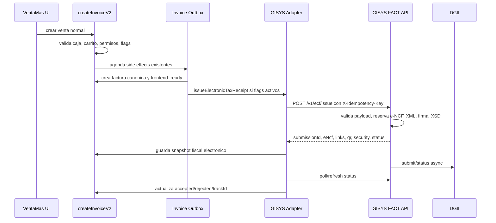

# Integracion VentaMas + GISYS FACT para e-CF DGII

Fecha: 2026-05-15
Rama revisada: `feat/electronic-tax-receipts`
Repos revisados:

- `C:\Dev\VentaMas`
- `C:\Dev\gisys\gisysapi`

## Decision recomendada

Integrar `gisysapi` como proveedor fiscal externo de e-CF, no copiar su logica dentro de VentaMas.

VentaMas debe seguir siendo fuente primaria de la venta: carrito, inventario, caja, CxC, cliente, factura canonica, contabilidad y reportes internos. GISYS FACT debe ser fuente primaria del ciclo e-CF: e-NCF, XML, firma digital, validacion XSD, envio DGII, TrackId, status DGII, RFCE, representacion impresa, QR y evidencias.

La integracion correcta es aditiva, por negocio, detras de flags ya existentes:

- `features.fiscal.electronicModelEnabled`
- `features.fiscal.electronicTransportEnabled`

Con flags apagados, VentaMas debe funcionar igual que hoy.

## Problema real

VentaMas ya emite comprobantes tradicionales serie `B` y tiene reportes DGII 606/607/608. DGII e-CF no es solo otro numero fiscal: requiere XML estandar, firma digital, comunicacion por Web Service, TrackId, consulta de estado, RFCE para consumo menor a RD$250,000, QR/RI y evidencia auditable.

GISYS FACT ya implementa gran parte de esa carga tecnica. Rehacerlo en VentaMas agrega complejidad accidental, duplica responsabilidad fiscal y aumenta riesgo de errores regulatorios.

## Complejidad

Complejidad esencial:

- Mapear factura VentaMas a `IssueDocumentPayload` de GISYS sin perder semantica fiscal.
- Evitar doble reserva de comprobantes: `Bxx` tradicional en VentaMas vs `Exx` electronico en GISYS.
- Mantener idempotencia entre `invoiceId` VentaMas y `submissionId` GISYS.
- Manejar estados asincronos: venta completada, e-CF firmado, enviado, aceptado, rechazado.
- Configurar tenant/contribuyente/certificado sin exponer secretos en VentaMas.
- Mantener fallback tradicional y rollout por negocio.

Complejidad accidental a evitar:

- Copiar builders XML, firma, XSD o transporte DGII desde `gisysapi` a VentaMas.
- Hacer llamadas directas a DGII desde VentaMas.
- Seguir mutando secuencias fiscales desde frontend.
- Usar `taxReceiptEnabled` como interruptor global para tributacion, comprobante y transporte electronico.
- Mezclar `ncfLedger` con ciclo e-CF. Ese objeto es indice/proyeccion de secuencia, no ledger fiscal completo.

## Evidencia local

### VentaMas

Superficies actuales relevantes:

- `functions/src/app/versions/v2/invoice/controllers/createInvoice.controller.js`
  - `createInvoiceV2` crea factura pendiente con idempotencia.
  - valida caja abierta, acceso de usuario, suscripcion y carrito.
  - exige `ncfType` si `ncf.enabled` o `taxReceiptEnabled` esta activo.
- `functions/src/app/versions/v2/invoice/services/orchestrator.service.js`
  - crea `invoicesV2/{invoiceId}`.
  - agenda outbox: inventario, factura canonica, caja, preorden, CxC, notas de credito.
  - reserva NCF tradicional mediante `reserveNcf` cuando `ncfEnabled=true`.
- `functions/src/app/versions/v2/invoice/services/ncf.service.js`
  - reserva NCF transaccionalmente.
  - actualiza `taxReceipts`.
  - crea `ncfUsage` en estado `pending`.
- `functions/src/app/versions/v2/invoice/services/finalize.service.js`
  - consume `ncfUsage` al finalizar factura.
  - marca `invoicesV2` como `committed`.
  - crea evento contable si aplica.
- `functions/src/app/modules/taxReceipt/utils/fiscalRollout.util.js`
  - ya expone `electronicModelEnabled` y `electronicTransportEnabled`.
- `functions/src/app/modules/compliance/*`
  - ya existen builders/exports DGII 606/607/608 y motor 607.
- `src/firebase/taxReceipt/taxReceiptTemplates.ts`
  - plantillas DO actuales: `B02`, `B01`, `B15`, `B04`.

Conclusion VentaMas: base de venta y comprobante tradicional existe. Falta capa electronica de proveedor, no motor DGII desde cero.

### GISYS FACT

Superficies actuales relevantes:

- `functions/src/routes/api.ts`
  - `POST /v1/ecf/issue`
  - `GET /v1/ecf/:submissionId/status`
  - `GET /v1/ecf/:submissionId/xml`
  - `GET /v1/ecf/:submissionId/pdf`
  - `GET /v1/submissions/*`
  - retry, audit, dead letters, exception events.
- `functions/src/modules/submissions/issue.controller.ts`
  - requiere `Authorization: Bearer`.
  - requiere `X-Idempotency-Key`.
  - responde `202` con `submissionId`, `eNcf`, estados, `qr`, `security`, `links`.
- `functions/src/modules/submissions/submissions.types.ts`
  - contrato `IssueDocumentPayload` incluye `integrationInstanceCode`, `taxpayerCode`, `documentType`, `invoiceInternalId`, `issuedAt`, `buyer`, `items`, `totals`, `reference`, `meta`.
- `functions/src/modules/submissions/submissionMaterialization.service.ts`
  - genera XML.
  - firma XML.
  - valida XSD.
  - persiste `ecf.xml`, `signed-ecf.xml`, evidencia de firma, QR y datos de impresion.
- `functions/src/modules/xml/xml.types.ts`
  - soporta `E31`, `E32`, `E33`, `E34`, `E41`, `E43`, `E44`, `E45`, `E46`, `E47`.
- `functions/src/middleware/authenticateClient.ts`
  - autenticacion cliente por Bearer token.
- `functions/src/middleware/validateQuota.ts`
  - cuota por minuto, mensual y anual.
- `docs/local-test-coverage.md`
  - suite local cubre issue, submit queue, status queue, XML firmado, XSD, RI, QR, inbound ack y set Ventamax/Newman.
- `docs/local-test-known-gaps.md`
  - pruebas locales son smoke; no sustituyen certificacion completa DGII.
- `docs/dgii-certification-checklist.md`
  - local cerrado en XML, firma, preflight, XSD pipeline, mock submit/status, QR, RI, RFCE, inbound ack.
  - pendientes: revision visual PDF, verificacion documento por documento, fixture Excel DGII, pruebas DGII TEST/CERT.

Conclusion GISYS: ya es middleware fiscal multi-tenant avanzado. Todavia no queda probado contra DGII TEST/CERT en esta revision, asi que no se debe vender como certificado productivo hasta cerrar esa etapa.

## Fuente DGII usada

Referencia oficial revisada: [Informe Tecnico Comprobante Fiscal Electronico v1.0](https://dgii.gov.do/cicloContribuyente/facturacion/comprobantesFiscalesElectronicosE-CF/Documentacin%20sobre%20eCF/Informe%20y%20Descripci%C3%B3n%20T%C3%A9cnica/Informe%20T%C3%A9cnico%20e-CF%20v1.0.pdf).

Puntos relevantes:

- e-CF se basa en XML y schema XSD.
- DGII usa Web Services para autenticacion, recepcion e-CF, recepcion RFCE, aprobacion comercial y consultas.
- recepcion e-CF devuelve TrackId.
- RFCE aplica para Factura de Consumo Electronica menor a RD$250,000.
- RI del e-CF es parte del modelo operativo.
- documento fue actualizado con bitacora al 23-03-2026, incluyendo contingencia segun Decreto 587-24.

## Frontera de propiedad

| Area | Fuente primaria | Razon |
|---|---|---|
| Venta, carrito, cliente POS | VentaMas | flujo operativo existente |
| Inventario, caja, CxC, seguros | VentaMas | side effects ya controlados por outbox |
| Factura canonica `invoices/{invoiceId}` | VentaMas | UI, reportes, contabilidad |
| `invoicesV2/{invoiceId}` e idempotencia de venta | VentaMas | orquestador actual |
| Comprobante tradicional `Bxx` | VentaMas | legacy actual con `reserveNcf` |
| e-CF `Exx`, XML, firma, envio DGII | GISYS | dominio especializado ya construido |
| Certificado digital tributario | GISYS | evita secretos fiscales en VentaMas |
| TrackId, status DGII, XML/PDF/QR fiscal | GISYS | evidencia del proveedor fiscal |
| 606/607/608 internos actuales | VentaMas | compliance mensual existente y conciliacion interna |

## Arquitectura propuesta



### Regla central

Para negocio sin e-CF activo:

- VentaMas usa flujo actual.
- `reserveNcf` sigue generando `Bxx`.
- UI y reportes siguen como ahora.

Para negocio con `electronicModelEnabled=true` y `electronicTransportEnabled=false`:

- VentaMas puede construir payload/fiscal snapshot en modo sombra.
- No llama a GISYS.
- Sirve para validar mapeo sin riesgo fiscal.

Para negocio con ambos flags activos:

- VentaMas no debe reservar `Bxx` para documentos que se emiten como e-CF.
- VentaMas debe enviar el payload a GISYS.
- GISYS reserva `Exx` y devuelve `eNcf`.
- VentaMas guarda snapshot electronico y usa ese snapshot para UI/impresion/estado.

## Contrato de configuracion

Agregar configuracion por negocio, idealmente bajo `business.features.fiscal.gisys` o `businesses/{businessId}/settings/electronicTaxReceipt`.

Campos minimos:

```ts
type GisysFiscalProviderConfig = {
  provider: 'gisys';
  enabled: boolean;
  environment: 'local' | 'test' | 'cert' | 'prod';
  baseUrl: string;
  integrationInstanceCode: string;
  taxpayerCode: string;
  clientTokenSecretRef: string;
  issueTimeoutMs: number;
  pollTimeoutMs: number;
  mode: 'shadow' | 'pilot' | 'required';
};
```

No guardar token plano en Firestore. Usar Secret Manager o mecanismo equivalente ya usado por backend.

## Snapshot fiscal en factura

Guardar en `invoicesV2/{invoiceId}` y propagar a `invoices/{invoiceId}.data` solo lo necesario para lectura/UI.

Forma recomendada:

```ts
type ElectronicFiscalSnapshot = {
  provider: 'gisys';
  documentType: 'E31' | 'E32' | 'E33' | 'E34' | 'E41' | 'E43' | 'E44' | 'E45' | 'E46' | 'E47';
  submissionId: string;
  eNcf: string | null;
  requestStatus: string | null;
  localStatus: string | null;
  dgiiSubmissionStatus: string | null;
  dgiiValidationStatus: string | null;
  dgiiTrackId: string | null;
  signedAt: string | null;
  securityCode: string | null;
  qrUrl: string | null;
  printStatus: string | null;
  links: {
    status?: string;
    xml?: string;
    signedXml?: string;
    pdf?: string;
  };
  lastSyncAt: unknown;
  lastError?: {
    code: string;
    message: string;
    at: unknown;
  } | null;
};
```

No reemplazar `NCF` legacy de golpe. Durante transicion:

- legacy: `data.NCF = Bxx`.
- electronico: `data.fiscal.electronic.eNcf = Exx`.
- vistas nuevas deben leer `fiscal.electronic.eNcf ?? NCF`.
- compliance/reportes deben distinguir `legacy_ncf` vs `electronic_ecf`.

## Mapeo documental inicial

Mapeo recomendado desde plantillas actuales VentaMas:

| VentaMas actual | Tipo fiscal | GISYS e-CF |
|---|---|---|
| `B01` / CREDITO FISCAL | venta con credito fiscal | `E31` |
| `B02` / CONSUMIDOR FINAL | consumo | `E32` |
| `B04` / NOTAS DE CREDITO | nota de credito | `E34` |
| `B15` / GUBERNAMENTAL | gubernamental | `E45` |

Pendientes por falta de plantilla actual en VentaMas:

- `E33` nota de debito.
- `E44` regimenes especiales.
- `E46` exportaciones.
- `E47` pagos al exterior.
- `E41` compras no pertenece al flujo de venta POS; no debe entrar en la primera integracion de ventas.

## Punto de integracion en VentaMas

Usar outbox existente de `invoicesV2`, no llamada directa desde frontend.

Nuevo task propuesto:

```ts
{
  type: 'issueElectronicTaxReceipt',
  status: 'pending',
  payload: {
    businessId,
    userId,
    invoiceId,
    canonicalInvoicePath,
    gisysConfigSnapshot,
    fiscalSelectionSnapshot
  }
}
```

Responsabilidades del worker:

1. Leer factura canonica y snapshot monetario.
2. Resolver config GISYS activa.
3. Mapear a `IssueDocumentPayload`.
4. Construir `X-Idempotency-Key` estable.
5. Llamar `POST /v1/ecf/issue`.
6. Guardar `ElectronicFiscalSnapshot`.
7. Programar/ejecutar refresh de estado.
8. Marcar error recuperable sin duplicar e-CF.

Idempotency key recomendada:

```txt
ventamas:{businessId}:{invoiceId}:ecf:{documentType}:v1
```

## Estado y UX esperado

Estados minimos para UI:

- `not_required`: negocio sin e-CF.
- `pending`: factura creada, e-CF pendiente.
- `signed_local`: GISYS genero e-NCF/XML/firma/QR.
- `submitted`: enviado a DGII, con TrackId.
- `accepted`: DGII acepto.
- `accepted_conditional`: DGII acepto con condicion.
- `rejected`: DGII rechazo.
- `error`: error local o transporte.

Regla de impresion:

- Legacy: imprimir como ahora.
- Electronico sin snapshot GISYS: no imprimir RI e-CF; mostrar factura en proceso o contingencia.
- Electronico con `signed_local`: puede mostrar RI/QR si politica del negocio lo permite.
- Electronico con `accepted` o `accepted_conditional`: estado final visible.
- `rejected`: bloquear reimpresion fiscal final y abrir flujo de correccion/anulacion, no editar factura posteada directamente.

## Fases de implementacion

### Fase 0: Preparacion GISYS

Objetivo: tener cliente Ventamax real en GISYS por ambiente.

Tareas:

- Crear client `ventamax`.
- Crear integration instance por ambiente.
- Crear taxpayer por RNC de negocio piloto.
- Subir certificado y validar vigencia.
- Crear token con scopes minimos: `ecf:issue`, `submissions:read`.
- Definir URL base local/QA/CERT/PROD.

Criterio de salida:

- `GET /v1/health` responde.
- `POST /v1/ecf/issue` local funciona con payload manual.
- `GET /v1/ecf/{submissionId}/status`, XML y PDF funcionan.

### Fase 1: Adapter shadow en VentaMas

Objetivo: construir payload GISYS desde factura VentaMas sin enviar.

Tareas:

- Crear modulo backend `electronicTaxReceipts`.
- Mapper `invoice -> IssueDocumentPayload`.
- Resolver tipo `Bxx -> Exx`.
- Validar totales, ITBIS, cliente, RNC, items.
- Persistir reporte dry-run en factura o subcoleccion de diagnostico.

Criterio de salida:

- Flags apagados: cero cambio funcional.
- `electronicModelEnabled=true`: payload se puede inspeccionar.
- Ninguna reserva `Bxx` adicional.
- Tests unitarios del mapper cubren `B01/E31`, `B02/E32`, `B04/E34`, `B15/E45`.

### Fase 2: Emision local contra GISYS emulator

Objetivo: VentaMas emite e-CF usando GISYS local.

Tareas:

- Agregar cliente HTTP backend con Bearer desde secreto.
- Agregar outbox task `issueElectronicTaxReceipt`.
- Guardar snapshot fiscal electronico.
- Agregar refresh status por callable/admin job o worker.
- Hacer que UI lea snapshot para mostrar e-NCF/status.

Criterio de salida:

- Una venta piloto genera `submissionId`.
- GISYS devuelve `eNcf`.
- VentaMas guarda `fiscal.electronic`.
- Retry con misma idempotency key no duplica e-CF.
- Venta tradicional sin flags sigue igual.

### Fase 3: QA/CERT controlado

Objetivo: probar contra ambiente externo sin abrir produccion.

Tareas:

- Apuntar negocio piloto a GISYS QA/CERT.
- Ejecutar E31/E32 primero.
- Validar status, TrackId, XML firmado, PDF/RI, QR.
- Registrar errores DGII como `lastError` y audit trail.
- No habilitar notas de credito hasta validar factura base.

Criterio de salida:

- E31 aceptada.
- E32 aceptada o RFCE correcto si aplica por monto.
- Rechazo DGII visible y recuperable.
- No se rompe cierre de caja, CxC ni contabilidad.

### Fase 4: Piloto negocio real

Objetivo: activar negocio controlado.

Tareas:

- Activar flags solo en negocio piloto.
- Definir si imprimir espera `signed_local` o `accepted`.
- Monitorear `submissions`, `exception-events`, `dead-letters`.
- Agregar panel o bloque minimo en factura para estado e-CF.
- Mantener fallback manual documentado.

Criterio de salida:

- Ventas diarias sin duplicados.
- e-CF sincronizado por factura.
- Soporte puede reintentar/consultar estado.
- Cliente ve comprobante electronico y QR correcto.

## Riesgos principales

### Doble secuencia fiscal

Riesgo: VentaMas reserva `Bxx` y GISYS reserva `Exx` para misma venta.

Mitigacion: con `electronicTransportEnabled=true`, no llamar `reserveNcf` para documentos electronicos. El selector puede seguir eligiendo "Credito Fiscal", pero la secuencia la emite GISYS como `E31`.

### Estado fiscal mas lento que venta

Riesgo: venta queda completada antes de aceptacion DGII.

Mitigacion: separar estado operativo de estado fiscal. Caja/inventario pueden cerrar, pero RI e-CF y estado legal deben depender de snapshot GISYS.

### Rechazo DGII despues de venta

Riesgo: factura operativa ya existe pero DGII rechaza XML.

Mitigacion: no editar factura posteada. Crear flujo de correccion/reintento/anulacion segun clasificacion. GISYS ya tiene `validation-error/corrections`, retry y exception events para apoyar esto.

### Certificado y secretos

Riesgo: VentaMas termina guardando `.p12` o passphrase.

Mitigacion: certificado vive en GISYS. VentaMas solo tiene token cliente guardado en secreto.

### Reportes 606/607/608

Riesgo: e-CF se mezcla con reportes legacy y duplica fiscalidad.

Mitigacion: primera fase no reescribe compliance mensual. Agregar marca `fiscalMode: legacy_ncf | electronic_ecf` y luego ajustar reportes con regla explicita.

### Certificacion incompleta

Riesgo: confundir pruebas locales GISYS con certificacion DGII.

Mitigacion: documento y rollout deben decir claro: local esta avanzado; DGII TEST/CERT aun pendiente segun docs revisados.

## No alcance inicial

- Reescribir DGII 606/607/608.
- Crear XML/firma/XSD dentro de VentaMas.
- Guardar certificados digitales en VentaMas.
- Migrar historico `Bxx` a `Exx`.
- Cambiar UI de settings completa.
- Habilitar todos los tipos e-CF de golpe.
- Automatizar aprobacion comercial receptor en VentaMas.

## Testing recomendado

### VentaMas

PowerShell 7.5.4:

```powershell
npm run lint:fast
npm run build
```

Tests backend focales cuando se implemente:

```powershell
npm run test:run:functions -- functions/src/app/modules/electronicTaxReceipts
```

Regresion critica:

- venta normal sin flags.
- venta con `taxReceiptEnabled=true` legacy.
- venta electronica shadow.
- venta electronica transport local.
- retry con misma idempotency key.
- rechazo GISYS simulado.

### GISYS

PowerShell 7.5.4:

```powershell
Push-Location C:\Dev\gisys\gisysapi
npm run build
npm run test:local:ventamax
Pop-Location
```

Para emuladores GISYS:

```powershell
Push-Location C:\Dev\gisys\gisysapi
firebase emulators:start --only functions,firestore,storage --import=.\emulator-data --export-on-exit
Pop-Location
```

## Deploy futuro

Este documento no modifica `functions/`. No hay deploy requerido ahora.

Cuando se implemente la integracion y se modifiquen funciones, desplegar solo funciones afectadas. Ejemplo esperado si se agrega callable/worker propio:

```powershell
firebase deploy --only "functions:createInvoiceV2,functions:processInvoiceOutbox,functions:refreshElectronicTaxReceiptStatus"
```

Ajustar lista exacta segun funciones tocadas.

## Orden recomendado

1. Cerrar contrato VentaMas -> GISYS en fixture local.
2. Implementar mapper shadow sin transporte.
3. Activar outbox contra GISYS local.
4. Persistir snapshot fiscal electronico.
5. Mostrar estado minimo en factura.
6. Probar E31/E32.
7. Pasar a GISYS QA/CERT.
8. Activar negocio piloto.
9. Agregar notas de credito E34.
10. Ajustar compliance/reportes para modo electronico.

## Conclusion

La ruta profesional es usar GISYS FACT como middleware fiscal e-CF y mantener VentaMas como sistema operativo/contable. Esto reduce complejidad accidental, preserva compatibilidad actual y deja el camino abierto para DGII electronico sin bloquear ventas existentes.

Primer corte implementable: mapper shadow + outbox `issueElectronicTaxReceipt` detras de flags, con GISYS local como proveedor.
