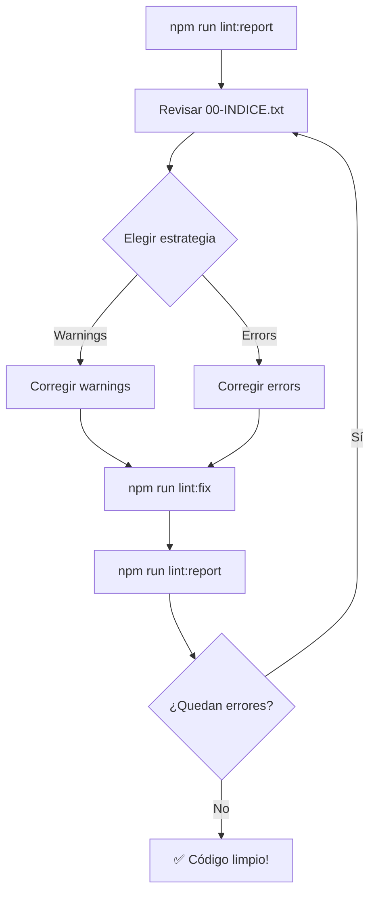

# Sistema de Gestión de Errores de Linting

Sistema completo para analizar y corregir errores de linting de forma organizada y eficiente.

## 🚀 Uso Rápido

### Comando Principal (TODO EN UNO)
```bash
npm run lint:report
```
Este comando:
1. ✅ Ejecuta ESLint en todo el proyecto
2. ✅ Guarda el reporte en `reports/lint-report.txt`
3. ✅ Crea división por tipo en `reports/by-type/` (PRINCIPAL)
4. ✅ Crea división secuencial en `reports/batches/` (REFERENCIA)

---

## 📋 Comandos Disponibles

### Comandos de Reporte
```bash
# Generar reporte completo + ambas divisiones (RECOMENDADO)
npm run lint:report

# Solo generar reporte sin dividir
npm run lint:report:quick

# Auto-corregir lo que se pueda
npm run lint:fix
```

### Comandos de División
```bash
# Solo dividir por tipo (usa reporte existente)
npm run lint:by-type

# Solo dividir secuencialmente (usa reporte existente)
npm run lint:batch

# Crear ambas divisiones (usa reporte existente)
npm run lint:split-all
```

---

## 📁 Estructura de Archivos Generados

```
reports/
├── lint-report.txt                    # Reporte completo de ESLint
│
├── by-type/                           # ⭐ DIVISIÓN PRINCIPAL (por tipo)
│   ├── 00-INDICE.txt                  # Resumen general
│   ├── errors/                        # Errores críticos (305)
│   │   ├── renders-parte-1-de-4.txt
│   │   ├── renders-parte-2-de-4.txt
│   │   ├── @typescript-eslint-no-empty-function.txt
│   │   ├── react-hooks-rules-of-hooks.txt
│   │   └── ...
│   └── warnings/                      # Advertencias (288)
│       ├── react-hooks-exhaustive-deps-parte-1-de-3.txt
│       ├── react-hooks-exhaustive-deps-parte-2-de-3.txt
│       └── ...
│
└── batches/                           # División secuencial (referencia)
    ├── 00-indice.txt
    ├── lote-001.txt
    ├── lote-002.txt
    └── ...
```

---

## 🎯 Flujo de Trabajo Recomendado

### 1️⃣ Generar Reporte Inicial
```bash
npm run lint:report
```

### 2️⃣ Revisar el Índice
```bash
# Abrir índice principal
code reports/by-type/00-INDICE.txt
```

Esto te mostrará:
- Total de errores vs warnings
- Top errores por tipo
- Top warnings por tipo

### 3️⃣ Estrategia de Corrección

#### **Opción A: Empezar con Warnings (más fácil)**
Los warnings son menos críticos y más fáciles de corregir:

```bash
# 1. react-hooks/exhaustive-deps (142 casos)
code reports/by-type/warnings/react-hooks-exhaustive-deps-parte-1-de-3.txt
```
**Solución típica**: Agregar dependencias faltantes al array de dependencias.

```bash
# 2. Otros warnings
code reports/by-type/warnings/react-refresh-only-export-components.txt
```

#### **Opción B: Empezar con Errores Críticos**
Los errores bloquean el build:

```bash
# 1. @typescript-eslint/no-empty-function (35 casos)
code reports/by-type/errors/@typescript-eslint-no-empty-function.txt
```
**Solución**: Eliminar funciones vacías o agregar comentario.

```bash
# 2. react-hooks/rules-of-hooks (28 casos)
code reports/by-type/errors/react-hooks-rules-of-hooks.txt
```
**Solución**: Mover hooks fuera de condicionales/loops.

### 4️⃣ Auto-Corrección
Después de revisar, intenta auto-corregir:
```bash
npm run lint:fix
```

Esto corregirá automáticamente ~30-40% de los problemas.

### 5️⃣ Regenerar Reporte
Después de corregir un lote:
```bash
npm run lint:report
```

Los archivos se actualizarán con los problemas restantes.

### 6️⃣ Repetir hasta completar
Continúa el ciclo: revisar → corregir → auto-fix → regenerar.

---

## 💡 Consejos Pro

### ✅ Ventajas de División por Tipo
1. **Aprendes patrones**: Al corregir el mismo error repetidamente
2. **Búsqueda/Reemplazo**: Puedes usar find & replace para casos similares
3. **Enfoque claro**: Una regla a la vez
4. **Priorización**: Separación clara entre errors y warnings

### 📊 Cuándo Usar División Secuencial
- Cuando quieres ver **todos los problemas de un archivo** junto
- Para **limpieza archivo por archivo**
- Como **referencia** para ver contexto completo

### 🔧 Personalización
Los scripts aceptan parámetros:

```bash
# Cambiar tamaño de lotes (default: 10)
powershell -File ./tools/split-lint-by-type.ps1 -MaxPerFile 100

# Usar otro archivo de reporte
powershell -File ./tools/split-lint-by-type.ps1 -InputFile "otro-reporte.txt"
```

---

## 📈 Estadísticas Actuales

**Total de problemas**: 593
- **Errores**: 305 (51%)
- **Warnings**: 288 (49%)

### Top 5 Errores
1. `renders` - 163 ocurrencias
2. `@typescript-eslint/no-empty-function` - 35 ocurrencias
3. `react-hooks/rules-of-hooks` - 28 ocurrencias
4. `render` - 26 ocurrencias
5. `preserved` - 14 ocurrencias

### Top 5 Warnings
1. `react-hooks/exhaustive-deps` - 142 ocurrencias
2. `sin-regla` - 140 ocurrencias
3. `react-refresh/only-export-components` - 5 ocurrencias
4. `unused-imports/no-unused-vars` - 1 ocurrencia

---

## 🎓 Recursos de Ayuda

### Reglas Comunes y Cómo Corregirlas

#### `react-hooks/exhaustive-deps`
**Problema**: Dependencias faltantes en hooks.
**Solución**: Agregar al array de dependencias o usar `// eslint-disable-next-line`.

#### `@typescript-eslint/no-empty-function`
**Problema**: Funciones vacías.
**Solución**: Eliminar o agregar comentario `// TODO: implementar`.

#### `react-hooks/rules-of-hooks`
**Problema**: Hooks llamados condicionalmente.
**Solución**: Mover hooks al nivel superior del componente.

#### `import/no-unresolved`
**Problema**: Imports no resueltos.
**Solución**: Verificar rutas o agregar a `ignore` en eslint.config.js.

---

## 🔄 Workflow Completo



---

## 📝 Notas

- Los archivos se regeneran completamente cada vez que ejecutas los scripts
- Los reportes están en `.gitignore` (no se suben al repo)
- Puedes trabajar en múltiples lotes en paralelo
- Haz commits frecuentes después de cada lote completado

---

## 🆘 Soporte

Si encuentras problemas:
1. Verifica que existe `reports/lint-report.txt`
2. Ejecuta `npm run lint:report:quick` para regenerar el reporte
3. Ejecuta `npm run lint:split-all` para regenerar las divisiones
